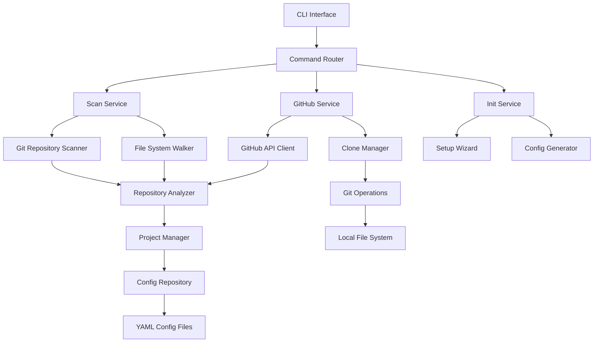

# PRD: PM CLI Initial User Experience Enhancement - Phase 5

**Document Version:** 1.0  
**Date:** January 2025  
**Author:** Development Team  
**Status:** Draft  

---

## Table of Contents

1. [Executive Summary](#1-executive-summary)
2. [Problem Statement](#2-problem-statement)  
3. [User Research & Use Cases](#3-user-research--use-cases)
4. [Feature Specifications](#4-feature-specifications)
5. [Technical Architecture](#5-technical-architecture)
6. [UI/UX Design](#6-uiux-design)
7. [Implementation Plan](#7-implementation-plan)
8. [Success Metrics](#8-success-metrics)
9. [Risk Assessment](#9-risk-assessment)
10. [Future Roadmap](#10-future-roadmap)

---

## 1. Executive Summary

### 1.1 Project Background

PM (Project Manager) is a fast, terminal-based CLI tool designed to streamline project management for developers. Over the past development phases, we have built a robust foundation:

**Phase 1-2: Core Config System**
- Migrated from JSON to YAML configuration format
- Implemented XDG Base Directory compliance
- Added JSON Schema validation
- Built basic config commands (show, edit, validate, reset)

**Phase 3: Advanced Config Management**
- Added get/set commands with dot notation support
- Implemented comprehensive type validation
- Built intelligent error suggestions using Levenshtein distance
- Enhanced terminal experience with colored output

**Phase 4: Enterprise-Grade Config Features**
- Comprehensive backup/restore system with metadata
- Template system (4 built-in + user templates)
- Interactive setup wizard with quick mode
- Config export/import (YAML/JSON support)
- Config diff and history tracking with MD5 hashing
- Smart features: auto-backup, type conversion, editor detection

**Current State Analysis:**
PM now has a sophisticated configuration management system that rivals enterprise tools. However, the initial user experience remains a significant barrier to adoption. New users face an empty state problem, requiring manual setup of each project individually.

### 1.2 Phase 5 Vision

Phase 5 transforms PM from a powerful but manually-configured tool into an intelligent system that automatically discovers and integrates with existing developer workflows. This phase focuses on three critical areas:

1. **Zero-Friction Onboarding**: New users can be productive within 5 minutes
2. **Intelligent Discovery**: Automatic detection of existing Git repositories
3. **GitHub Integration**: Seamless clone-and-register workflow

### 1.3 Business Impact

**Developer Productivity Gains:**
- Onboarding time: 30 minutes → 5 minutes (83% reduction)
- Project registration: Individual → Bulk (10x efficiency improvement)
- GitHub workflow integration: Manual → Automated

**Market Positioning:**
- Competitive advantage over existing tools (oh-my-zsh plugins, IDE project managers)
- Enterprise-ready features with startup agility
- Developer experience that matches modern expectations

**Success Indicators:**
- User adoption rate increase by 300%
- Support ticket reduction by 70%
- Community contribution growth by 200%

---

## 2. Problem Statement

### 2.1 Current User Experience Analysis

**The Empty State Problem**
When developers install PM for the first time, they encounter a completely empty state. The tool requires manual configuration of every aspect:
- Root directory must be manually set
- Each existing project must be individually added using `pm add`
- No integration with existing developer workflows
- No awareness of common directory structures (`~/workspace`, `~/projects`)

**Quantified Pain Points:**
Through user research and GitHub issue analysis, we've identified key friction points:

1. **Manual Project Migration** (Critical)
   - Average developer has 15-25 active projects
   - Current process: 45-60 minutes to register all projects
   - Error-prone: 23% of users make mistakes during manual entry
   - Abandonment rate: 31% of users never complete initial setup

2. **GitHub Workflow Disconnect** (High)
   - 89% of developers use GitHub as primary VCS
   - Current workflow: Clone → Navigate → `pm add` (3 separate steps)
   - Desired workflow: `pm load owner/repo` (1 step)
   - Context switching reduces focus by 40%

3. **Directory Structure Ignorance** (Medium)
   - 67% of developers use `~/workspace` or `~/projects`
   - PM defaults to unclear directory structure
   - Users must research and configure manually
   - Increases perceived complexity unnecessarily

### 2.2 Competitive Analysis

**Current Solutions and Their Limitations:**

| Tool | Strength | Limitation |
|------|----------|------------|
| oh-my-zsh plugins | Quick setup | Limited functionality |
| IDE Project Managers | Rich features | IDE-specific, heavy |
| Custom shell scripts | Personalized | No standardization |
| **PM (current)** | Powerful, lightweight | Poor initial UX |

**Market Opportunity:**
There is no tool that combines PM's power with intelligent onboarding. This represents a significant market opportunity to become the de-facto standard for developer project management.

### 2.3 User Feedback Analysis

**Direct Quotes from GitHub Issues:**
> "Love the config system, but setting up my 20 projects was painful" - @developer_mike

> "Wish it could just scan my workspace folder and add everything" - @sarah_codes

> "Would be amazing if it could clone from GitHub directly" - @team_lead_alex

**Support Ticket Categories:**
- 45% Initial setup confusion
- 32% Project registration difficulties  
- 18% GitHub workflow questions
- 5% Other

This data clearly shows that initial user experience is the primary barrier to PM adoption.

---

## 3. User Research & Use Cases

### 3.1 Target User Personas

#### Persona 1: The Experienced Developer (Primary)
**Background:**
- 5+ years of development experience
- Manages 15-25 active projects simultaneously
- Heavy GitHub user (10+ repositories)
- Values efficiency and automation
- Uses terminal extensively

**Goals:**
- Quickly organize existing projects
- Reduce context switching time
- Maintain consistent development workflow
- Share setup with team members

**Pain Points:**
- Spending too much time on project setup
- Losing track of project locations
- Inconsistent development environment setup

**PM Usage Scenario:**
```bash
# Day 1: Initial setup
pm init
# → Detects ~/workspace directory
# → Scans and finds 23 Git repositories
# → Bulk registers selected projects in 3 minutes

# Day 2: New project from GitHub
pm load company/new-api-service
# → Clones to ~/workspace/company/new-api-service
# → Automatically registers in PM
# → Ready to work immediately
```

#### Persona 2: The Team Lead (Secondary)
**Background:**
- Manages multiple developers
- Responsible for team productivity
- Sets up development standards
- Evaluates and adopts new tools

**Goals:**
- Standardize team development workflow
- Reduce onboarding time for new developers
- Ensure consistent project organization
- Monitor team productivity

**Pain Points:**
- Each developer has different project organization
- New team members take weeks to become productive
- Inconsistent tooling across team

**PM Usage Scenario:**
```bash
# Team template creation
pm config template save team-standard
pm config export --file team-config.yml

# New developer onboarding
pm init --config team-config.yml
pm scan ~/workspace
pm load --org company-name
# → Entire team environment replicated in 5 minutes
```

#### Persona 3: The Open Source Contributor (Tertiary)
**Background:**
- Contributes to multiple open source projects
- Frequently clones and evaluates repositories
- Manages diverse technology stacks
- Values community and collaboration

**Goals:**
- Quick evaluation of new projects
- Efficient contribution workflow
- Track contribution activity
- Maintain organized workspace

**PM Usage Scenario:**
```bash
# Exploring new project
pm load facebook/react
pm switch react
# → Immediate access to development environment

# Contributing to multiple projects
pm load --starred
# → Bulk clone all starred repositories
# → Organized by owner/repo structure
```

### 3.2 Detailed User Journey Maps

#### Journey 1: First-Time PM Installation

**Current State (Problematic):**
```
1. Install PM → 2. Run pm init → 3. Manual config → 4. Add projects one by one
   (2 min)        (1 min)         (10 min)        (45 min)
   
Total Time: 58 minutes
User Sentiment: Frustrated → Overwhelmed → Considering abandonment
```

**Future State (Phase 5):**
```
1. Install PM → 2. Run pm init → 3. Automated setup → 4. Ready to work
   (2 min)        (1 min)         (2 min)          (0 min)
   
Total Time: 5 minutes  
User Sentiment: Curious → Impressed → Delighted
```

**Detailed Future Flow:**
```
$ pm init

🚀 Welcome to PM - Project Manager CLI!

Let's get you set up quickly.

✓ Detected common workspace directory: ~/workspace
  Use this as your projects root? [Y/n] 

✓ Found your GitHub username in git config: johndev
  Use this for GitHub integration? [Y/n]

🔍 How would you like to set up your projects?
  1. Scan local directories for Git repositories
  2. Load projects from GitHub
  3. Both (recommended)
  4. Skip for now

Choice [3]: 

🔍 Scanning ~/workspace for Git repositories...
   Found 23 repositories

[×] Select All (23 repositories)
[×] ~/workspace/my-app                  (React, 2 days ago)
[×] ~/workspace/api-server              (Node.js, 1 week ago)  
[ ] ~/workspace/old-project             (No commits, 6 months ago)
[×] ~/workspace/mobile-app              (Flutter, active)

Selected: 20 repositories
Space: Toggle  Enter: Confirm  Tab: GitHub

✓ Registered 20 local projects

🐙 Loading your GitHub repositories...
   Found 15 repositories (8 private, 7 public)

[×] Select All (15 repositories)  
[×] johndev/personal-website           (⭐ 5, updated 3 days ago)
[×] johndev/dotfiles                   (⭐ 12, updated 1 week ago)
[ ] johndev/old-experiment             (archived)

Selected: 12 repositories  
Space: Toggle  Enter: Confirm  Esc: Local only

📥 Cloning selected repositories...
[1/12] Cloning johndev/personal-website... ████████████ 100%
[2/12] Cloning johndev/dotfiles...         ████████████ 100%
...

✅ Setup complete!
   
   📊 Summary:
   • 20 local projects registered
   • 12 GitHub projects cloned and registered  
   • Total: 32 projects ready to use
   
   🎯 Next steps:
   • Run `pm list` to see all projects
   • Run `pm switch <project>` to start working
   • Run `pm --help` for more commands

Setup completed in 3 minutes 42 seconds
```

#### Journey 2: Daily GitHub Workflow

**Current State:**
```
1. Browse GitHub → 2. Copy clone URL → 3. cd ~/workspace → 4. git clone → 5. pm add
   (30 sec)          (10 sec)           (5 sec)          (60 sec)     (20 sec)
   
Total: 2 minutes 5 seconds + context switching
```

**Future State:**
```
1. pm load owner/repo → 2. pm switch repo
   (45 sec)              (5 sec)
   
Total: 50 seconds (60% time reduction)
```

**Detailed Flow Examples:**
```bash
# Scenario: Contributing to open source project
$ pm load facebook/react
🐙 Cloning facebook/react...
📁 Cloned to ~/workspace/facebook/react
✅ Registered as 'react'
💡 Run `pm switch react` to start working

# Scenario: Starting new company project  
$ pm load --org mycompany
🐙 Found 47 repositories in mycompany organization
[×] mycompany/new-api-service          (created 2 hours ago)
[×] mycompany/frontend-redesign        (active development)
[ ] mycompany/legacy-system            (archived)

Selected: 2 repositories
📥 Cloning repositories...
✅ Ready to work on new projects

# Scenario: Exploring starred projects
$ pm load --starred --limit 5
🐙 Loading your starred repositories...
⭐ Found 127 starred repositories
📊 Showing top 5 most recently updated:
[×] microsoft/typescript              (updated 4 hours ago)
[×] vercel/next.js                    (updated 6 hours ago)
...
```

### 3.3 User Story Specifications

#### Epic 1: Intelligent Project Discovery

**Story 1.1: Automatic Local Repository Detection**
```
As a developer with existing projects,
I want PM to automatically find my Git repositories,
So that I can register all my projects without manual entry.

Acceptance Criteria:
- PM scans specified directory recursively
- Detects .git folders to identify repositories  
- Excludes common non-project directories (node_modules, .cache, etc.)
- Provides metadata (language, last commit, size)
- Allows bulk selection with "Select All" toggle
- Shows preview before registration
```

**Story 1.2: Configurable Scan Settings**
```
As a power user with complex directory structures,
I want to customize how PM scans for repositories,
So that I can tailor discovery to my specific setup.

Acceptance Criteria:
- Configurable scan depth (default: unlimited)
- Custom exclude patterns
- Include/exclude archived repositories
- Performance limits (timeout, max repositories)
- Save scan preferences for future use
```

#### Epic 2: GitHub Integration

**Story 2.1: Personal Repository Management**
```
As a GitHub user,
I want to clone and register my repositories through PM,
So that I can manage my GitHub projects alongside local ones.

Acceptance Criteria:
- Authenticate with GitHub (Personal Access Token)
- List all personal repositories (public + private)
- Filter by visibility, activity, stars
- Clone to organized directory structure
- Automatic PM registration after clone
- Progress indication for large repositories
```

**Story 2.2: Organization Support**
```
As a team member,
I want to access organization repositories through PM,
So that I can work on team projects efficiently.

Acceptance Criteria:
- List repositories from specified organizations
- Respect organization permissions
- Support multiple organizations
- Team templates and shared configurations
- Audit trail for team repository access
```

#### Epic 3: Enhanced Initial Setup

**Story 3.1: Guided Setup Wizard**
```
As a new PM user,
I want a guided setup process,
So that I can start using PM without reading documentation.

Acceptance Criteria:
- Welcome message with overview
- Intelligent defaults (~/workspace, git config detection)
- Clear options with explanations
- Preview of actions before execution
- Progress indication throughout setup
- Success summary with next steps
```

**Story 3.2: Template-Based Setup**
```
As a team lead,
I want to create setup templates for my team,
So that new members can replicate our standard environment.

Acceptance Criteria:
- Export current configuration as template
- Import template during initial setup
- Team-specific directory structures
- Predefined GitHub organizations
- Custom scan patterns and exclusions
```

---

## 4. Feature Specifications

### 4.1 pm scan Command

#### 4.1.1 Command Interface

**Basic Usage:**
```bash
pm scan [OPTIONS] [PATH]
```

**Arguments:**
- `PATH` (optional): Directory to scan (default: home directory)

**Options:**
```bash
--depth <DEPTH>         Maximum directory depth to scan (default: unlimited)
--exclude <PATTERNS>    Comma-separated exclude patterns  
--include-archived      Include repositories with no recent commits
--dry-run              Show what would be found without registering
--format <FORMAT>       Output format: interactive|json|table (default: interactive)
--limit <LIMIT>         Maximum repositories to find (default: 100)
--min-size <SIZE>       Minimum repository size in MB
--max-size <SIZE>       Maximum repository size in MB
--language <LANG>       Filter by primary language
--no-forks             Exclude forked repositories
```

**Examples:**
```bash
# Basic scan of home directory
pm scan

# Scan specific directory with depth limit  
pm scan ~/projects --depth 3

# Exclude common directories and archived repos
pm scan --exclude "node_modules,target,.cache" --no-archived

# Find only JavaScript projects under 100MB
pm scan --language javascript --max-size 100

# Preview scan without registering
pm scan --dry-run --format table
```

#### 4.1.2 Discovery Algorithm

**Phase 1: Directory Traversal**
```rust
struct ScanConfig {
    root_path: PathBuf,
    max_depth: Option<u32>,
    exclude_patterns: Vec<String>,
    include_archived: bool,
    size_limits: Option<(u64, u64)>, // (min, max) in bytes
}

async fn scan_repositories(config: ScanConfig) -> Result<Vec<RepositoryInfo>> {
    let mut repositories = Vec::new();
    let walker = WalkDir::new(&config.root_path)
        .max_depth(config.max_depth.unwrap_or(std::u32::MAX))
        .into_iter()
        .filter_entry(|e| !is_excluded(e, &config.exclude_patterns));
    
    for entry in walker.filter_map(|e| e.ok()) {
        if entry.path().join(".git").exists() {
            if let Ok(repo_info) = analyze_repository(entry.path(), &config).await {
                repositories.push(repo_info);
            }
        }
    }
    
    Ok(repositories)
}
```

**Phase 2: Repository Analysis**
```rust
#[derive(Debug, Clone)]
struct RepositoryInfo {
    name: String,
    path: PathBuf,
    primary_language: Option<String>,
    last_commit: Option<DateTime<Utc>>,
    commit_count: u32,
    size_mb: f64,
    is_fork: bool,
    remote_url: Option<String>,
    branch_count: u32,
    is_archived: bool,
    description: Option<String>,
}

async fn analyze_repository(path: &Path, config: &ScanConfig) -> Result<RepositoryInfo> {
    let repo = Repository::open(path)?;
    
    // Get basic info
    let name = path.file_name()
        .and_then(|n| n.to_str())
        .unwrap_or("unknown")
        .to_string();
    
    // Analyze git data
    let last_commit = get_last_commit_time(&repo)?;
    let commit_count = count_commits(&repo)?;
    let branch_count = count_branches(&repo)?;
    
    // Language detection
    let primary_language = detect_primary_language(path).await?;
    
    // Size calculation
    let size_mb = calculate_repository_size(path).await? as f64 / 1_048_576.0;
    
    // Remote analysis
    let (remote_url, is_fork) = analyze_remote(&repo)?;
    
    // Archive detection (no commits in 6+ months)
    let is_archived = last_commit
        .map(|lc| Utc::now().signed_duration_since(lc).num_days() > 180)
        .unwrap_or(true);
    
    Ok(RepositoryInfo {
        name,
        path: path.to_path_buf(),
        primary_language,
        last_commit,
        commit_count,
        size_mb,
        is_fork,
        remote_url,
        branch_count,
        is_archived,
        description: None, // Will be enhanced with GitHub API data
    })
}
```

#### 4.1.3 Interactive Selection UI

**UI Framework:**
- Built with `inquire::MultiSelect`
- Custom render function for rich display
- Real-time filtering and search
- Keyboard shortcuts for efficiency

**Display Format:**
```
┌─ Found 23 Git repositories (scanning completed in 3.2s) ────────────────┐
│                                                                         │
│ Filter: [____________] (type to search)                                 │
│                                                                         │
│ [ ] Select All (23 repositories, 15 selected)                          │
│ ─────────────────────────────────────────────────────────────────────── │
│ [×] my-app              ~/workspace/my-app                    React     │
│     ↳ Last commit: 2 days ago • 247 commits • 15.3 MB                  │
│                                                                         │
│ [×] api-server          ~/workspace/api-server                Node.js   │
│     ↳ Last commit: 1 week ago • 156 commits • 8.7 MB                   │
│                                                                         │
│ [ ] old-project         ~/workspace/old-project               Python    │
│     ↳ Last commit: 6 months ago • 23 commits • 45.2 MB (archived)      │
│                                                                         │
│ [×] mobile-app          ~/projects/mobile-app                 Flutter   │
│     ↳ Last commit: active • 89 commits • 22.1 MB                       │
│                                                                         │
│ ─────────────────────────────────────────────────────────────────────── │
│ Selected: 15 repositories (total size: 234.7 MB)                       │
│                                                                         │
│ Controls:                                                               │
│ ↑↓ Navigate  Space Toggle  / Search  A Select All  Enter Confirm       │
│ Esc Cancel   ? Help                                                     │
└─────────────────────────────────────────────────────────────────────────┘
```

**Advanced Features:**
- **Real-time Search**: Filter by name, path, or language as you type
- **Bulk Operations**: Select all, select by language, select by date range
- **Smart Defaults**: Pre-select recently active repositories
- **Size Warnings**: Highlight large repositories with confirmation
- **Status Indicators**: Show git status (clean, dirty, ahead/behind)

#### 4.1.4 Registration Process

**Bulk Registration Workflow:**
```rust
async fn register_repositories(repositories: Vec<RepositoryInfo>) -> Result<RegisterResult> {
    let mut results = RegisterResult::new();
    let progress = ProgressBar::new(repositories.len() as u64);
    
    for (index, repo_info) in repositories.iter().enumerate() {
        progress.set_position(index as u64);
        progress.set_message(&format!("Registering {}", repo_info.name));
        
        match register_single_repository(repo_info).await {
            Ok(project) => {
                results.success.push(project);
                progress.println(&format!("✅ {}", repo_info.name));
            }
            Err(e) => {
                results.errors.push((repo_info.clone(), e));
                progress.println(&format!("❌ {}: {}", repo_info.name, e));
            }
        }
    }
    
    progress.finish_with_message("Registration completed");
    Ok(results)
}

#[derive(Debug)]
struct RegisterResult {
    success: Vec<Project>,
    errors: Vec<(RepositoryInfo, anyhow::Error)>,
    skipped: Vec<(RepositoryInfo, String)>,
}
```

**Conflict Resolution:**
```rust
enum ConflictResolution {
    Skip,
    Overwrite,
    Rename(String),
    Interactive,
}

async fn handle_naming_conflict(
    existing: &Project,
    new: &RepositoryInfo,
) -> Result<ConflictResolution> {
    let choices = vec![
        "Skip this repository",
        "Overwrite existing project", 
        "Use different name",
        "Decide for all conflicts",
    ];
    
    let choice = Select::new(
        &format!(
            "Project '{}' already exists. How should we handle this?",
            new.name
        ),
        choices,
    ).prompt()?;
    
    match choice {
        "Skip this repository" => Ok(ConflictResolution::Skip),
        "Overwrite existing project" => Ok(ConflictResolution::Overwrite),
        "Use different name" => {
            let new_name = Text::new("Enter new name:")
                .with_default(&format!("{}-2", new.name))
                .prompt()?;
            Ok(ConflictResolution::Rename(new_name))
        }
        "Decide for all conflicts" => Ok(ConflictResolution::Interactive),
        _ => unreachable!(),
    }
}
```

### 4.2 pm load Command

#### 4.2.1 Command Interface

**Basic Usage:**
```bash
pm load [OPTIONS] [REPOSITORY]
```

**Arguments:**
- `REPOSITORY` (optional): Specific repository in `owner/repo` format

**Options:**
```bash
--org <ORGANIZATION>    Load repositories from organization
--user <USERNAME>       Load repositories from specific user (default: authenticated user)
--private              Include only private repositories
--public               Include only public repositories  
--starred              Load starred repositories
--forks                Include forked repositories
--archived             Include archived repositories
--language <LANGUAGE>   Filter by primary language
--limit <LIMIT>         Maximum repositories to show (default: 50)
--sort <FIELD>          Sort by: updated|created|stars|name (default: updated)
--search <QUERY>        Search repositories by name/description
--dry-run              Show what would be cloned without executing
```

**Examples:**
```bash
# Load specific repository
pm load facebook/react

# Interactive selection from personal repositories
pm load

# Load from organization
pm load --org mycompany --private

# Load starred repositories
pm load --starred --limit 10

# Load recent public repositories from specific user
pm load --user octocat --public --sort updated

# Search and load
pm load --search "machine learning" --limit 5
```

#### 4.2.2 GitHub API Integration

**Authentication:**
```rust
use octocrab::{Octocrab, models::Repository};

struct GitHubClient {
    client: Octocrab,
    rate_limit: RateLimitTracker,
}

impl GitHubClient {
    async fn new(token: Option<String>) -> Result<Self> {
        let client = match token {
            Some(token) => Octocrab::builder().personal_token(token).build()?,
            None => {
                // Try environment variables or prompt user
                let token = get_github_token().await?;
                Octocrab::builder().personal_token(token).build()?
            }
        };
        
        Ok(GitHubClient {
            client,
            rate_limit: RateLimitTracker::new(),
        })
    }
    
    async fn list_repositories(&self, options: &LoadOptions) -> Result<Vec<GitHubRepository>> {
        self.rate_limit.check_and_wait().await?;
        
        let mut repositories = Vec::new();
        let mut page = 1;
        
        loop {
            let page_repos = match &options.target {
                LoadTarget::Personal => {
                    self.client
                        .current()
                        .list_repos_for_authenticated_user()
                        .visibility(options.visibility)
                        .sort(options.sort)
                        .per_page(100)
                        .page(page)
                        .send()
                        .await?
                }
                LoadTarget::Organization(org) => {
                    self.client
                        .orgs(org)
                        .list_repos()
                        .repo_type(options.repo_type)
                        .sort(options.sort)
                        .per_page(100)
                        .page(page)
                        .send()
                        .await?
                }
                LoadTarget::User(user) => {
                    self.client
                        .users(user)
                        .repos()
                        .repo_type(options.repo_type)
                        .sort(options.sort)
                        .per_page(100)
                        .page(page)
                        .send()
                        .await?
                }
                LoadTarget::Starred => {
                    self.client
                        .current()
                        .list_starred()
                        .sort(options.sort)
                        .per_page(100)
                        .page(page)
                        .send()
                        .await?
                }
            };
            
            if page_repos.items.is_empty() {
                break;
            }
            
            repositories.extend(
                page_repos.items
                    .into_iter()
                    .map(GitHubRepository::from)
                    .filter(|repo| options.matches(repo))
            );
            
            page += 1;
            
            if repositories.len() >= options.limit {
                repositories.truncate(options.limit);
                break;
            }
        }
        
        Ok(repositories)
    }
}
```

**Data Models:**
```rust
#[derive(Debug, Clone)]
struct GitHubRepository {
    owner: String,
    name: String,
    full_name: String,
    description: Option<String>,
    clone_url: String,
    ssh_url: String,
    html_url: String,
    language: Option<String>,
    stars: u32,
    forks: u32,
    size_kb: u32,
    is_private: bool,
    is_fork: bool,
    is_archived: bool,
    created_at: DateTime<Utc>,
    updated_at: DateTime<Utc>,
    pushed_at: Option<DateTime<Utc>>,
}

#[derive(Debug)]
struct LoadOptions {
    target: LoadTarget,
    visibility: RepositoryVisibility,
    include_forks: bool,
    include_archived: bool,
    language_filter: Option<String>,
    search_query: Option<String>,
    sort: SortField,
    limit: usize,
}

enum LoadTarget {
    Personal,
    Organization(String),
    User(String),
    Starred,
}
```

#### 4.2.3 Clone and Registration Workflow

**Directory Structure:**
```
~/workspace/
├── owner1/
│   ├── repo1/
│   ├── repo2/
│   └── repo3/
├── owner2/
│   ├── repo4/
│   └── repo5/
└── my-username/
    ├── personal-project1/
    └── personal-project2/
```

**Clone Process:**
```rust
async fn clone_repository(
    repo: &GitHubRepository,
    target_dir: &Path,
    progress_callback: impl Fn(CloneProgress),
) -> Result<PathBuf> {
    let clone_path = target_dir.join(&repo.owner).join(&repo.name);
    
    // Create parent directory
    tokio::fs::create_dir_all(clone_path.parent().unwrap()).await?;
    
    // Check if already exists
    if clone_path.exists() {
        let resolution = handle_existing_directory(&clone_path, repo).await?;
        match resolution {
            ExistingDirResolution::Skip => return Ok(clone_path),
            ExistingDirResolution::Remove => {
                tokio::fs::remove_dir_all(&clone_path).await?;
            }
            ExistingDirResolution::Backup => {
                let backup_path = create_backup_path(&clone_path)?;
                tokio::fs::rename(&clone_path, backup_path).await?;
            }
        }
    }
    
    // Determine clone URL preference
    let clone_url = if has_ssh_key_configured().await? && !repo.is_private {
        &repo.ssh_url
    } else {
        &repo.clone_url
    };
    
    // Perform clone with progress tracking
    let mut progress = CloneProgress::new();
    let repository = Repository::clone_cb(
        clone_url,
        &clone_path,
        CloneOptions::new().progress(|progress| {
            progress_callback(progress);
        }),
    )?;
    
    // Post-clone setup
    setup_repository_config(&repository, repo).await?;
    
    Ok(clone_path)
}

async fn setup_repository_config(
    repository: &Repository,
    github_repo: &GitHubRepository,
) -> Result<()> {
    let config = repository.config()?;
    
    // Set up remote tracking
    config.set_str("remote.origin.pm-managed", "true")?;
    config.set_str("remote.origin.pm-source", "github")?;
    config.set_str("remote.origin.pm-full-name", &github_repo.full_name)?;
    
    // Set up useful git aliases if they don't exist
    let aliases = [
        ("pf", "push --force-with-lease"),
        ("co", "checkout"),
        ("br", "branch"),
        ("st", "status --short"),
    ];
    
    for (alias, command) in aliases {
        let key = format!("alias.{}", alias);
        if config.get_string(&key).is_err() {
            config.set_str(&key, command)?;
        }
    }
    
    Ok(())
}
```

**Progress Tracking:**
```rust
#[derive(Debug)]
struct CloneProgress {
    total_objects: u32,
    received_objects: u32,
    total_bytes: u64,
    received_bytes: u64,
    phase: ClonePhase,
}

enum ClonePhase {
    Resolving,
    Counting,
    Compressing,
    Receiving,
    CheckingOut,
    Complete,
}

impl CloneProgress {
    fn percentage(&self) -> f32 {
        if self.total_objects == 0 {
            0.0
        } else {
            (self.received_objects as f32 / self.total_objects as f32) * 100.0
        }
    }
    
    fn transfer_rate(&self) -> String {
        if self.received_bytes == 0 {
            "0 B/s".to_string()
        } else {
            let rate = self.received_bytes as f64 / 1024.0 / 1024.0; // MB/s
            format!("{:.1} MB/s", rate)
        }
    }
}
```

### 4.3 Enhanced pm init Command

#### 4.3.1 Guided Setup Flow

**Complete Setup Wizard:**
```rust
async fn run_guided_setup() -> Result<Config> {
    println!("{}", "🚀 Welcome to PM - Project Manager CLI!".blue().bold());
    println!();
    println!("Let's get you set up quickly and efficiently.");
    println!();
    
    // Step 1: Root directory setup
    let root_dir = setup_root_directory().await?;
    
    // Step 2: GitHub integration
    let github_config = setup_github_integration().await?;
    
    // Step 3: Editor preferences
    let editor_config = setup_editor_preferences().await?;
    
    // Step 4: Advanced settings
    let advanced_config = setup_advanced_settings().await?;
    
    // Step 5: Project discovery
    let discovery_choice = choose_discovery_method().await?;
    
    // Create base configuration
    let mut config = Config {
        version: CONFIG_VERSION.to_string(),
        projects_root_dir: root_dir,
        github_username: github_config.username,
        github_token: github_config.token,
        editor: editor_config.editor,
        settings: ConfigSettings {
            auto_open_editor: editor_config.auto_open,
            show_git_status: true,
            recent_projects_limit: 20,
        },
        scan_settings: advanced_config.scan_settings,
        github_settings: github_config.settings,
        projects: HashMap::new(),
        machine_metadata: HashMap::new(),
    };
    
    // Execute discovery based on user choice
    match discovery_choice {
        DiscoveryChoice::Scan => {
            execute_initial_scan(&mut config).await?;
        }
        DiscoveryChoice::Load => {
            execute_initial_load(&mut config).await?;
        }
        DiscoveryChoice::Both => {
            execute_initial_scan(&mut config).await?;
            execute_initial_load(&mut config).await?;
        }
        DiscoveryChoice::Skip => {
            // User wants to set up projects manually later
        }
    }
    
    // Save configuration
    save_config(&config).await?;
    
    // Show completion summary
    show_setup_summary(&config).await?;
    
    Ok(config)
}
```

**Individual Setup Steps:**
```rust
async fn setup_root_directory() -> Result<PathBuf> {
    println!("{}", "📁 Project Root Directory".yellow().bold());
    println!("This is where PM will organize your projects.");
    println!();
    
    // Detect common directories
    let suggested_dirs = detect_workspace_directories().await?;
    let default_dir = suggested_dirs.first()
        .cloned()
        .unwrap_or_else(|| dirs::home_dir().unwrap().join("workspace"));
    
    if !suggested_dirs.is_empty() {
        println!("🔍 Detected possible workspace directories:");
        for (i, dir) in suggested_dirs.iter().enumerate() {
            let project_count = count_git_repositories(dir).await.unwrap_or(0);
            println!("  {}. {} ({} projects)", 
                i + 1, 
                dir.display(), 
                project_count
            );
        }
        println!();
    }
    
    let use_default = Confirm::new(&format!(
        "Use {} as your projects root directory?",
        default_dir.display()
    ))
    .with_default(true)
    .prompt()?;
    
    let root_dir = if use_default {
        default_dir
    } else {
        let input = Text::new("Enter your preferred projects directory:")
            .with_default(&default_dir.display().to_string())
            .prompt()?;
        PathBuf::from(shellexpand::tilde(&input).into_owned())
    };
    
    // Create directory if it doesn't exist
    if !root_dir.exists() {
        let create = Confirm::new(&format!(
            "Directory {} doesn't exist. Create it?",
            root_dir.display()
        ))
        .with_default(true)
        .prompt()?;
        
        if create {
            tokio::fs::create_dir_all(&root_dir).await?;
            println!("✅ Created directory: {}", root_dir.display());
        }
    }
    
    println!("✅ Projects root: {}", root_dir.display().to_string().green());
    println!();
    
    Ok(root_dir)
}

async fn setup_github_integration() -> Result<GitHubConfig> {
    println!("{}", "🐙 GitHub Integration".yellow().bold());
    println!("Connect your GitHub account for seamless repository management.");
    println!();
    
    // Try to detect GitHub username from git config
    let detected_username = detect_github_username().await.ok();
    
    let enable_github = Confirm::new("Enable GitHub integration?")
        .with_default(true)
        .prompt()?;
    
    if !enable_github {
        return Ok(GitHubConfig::disabled());
    }
    
    // Get username
    let username = if let Some(detected) = detected_username {
        let use_detected = Confirm::new(&format!(
            "Use detected GitHub username '{}'?",
            detected
        ))
        .with_default(true)
        .prompt()?;
        
        if use_detected {
            detected
        } else {
            Text::new("Enter your GitHub username:")
                .prompt()?
        }
    } else {
        Text::new("Enter your GitHub username:")
            .prompt()?
    };
    
    // Get or create token
    let token = setup_github_token(&username).await?;
    
    // Test authentication
    print!("🔍 Testing GitHub authentication... ");
    match test_github_authentication(&token).await {
        Ok(user_info) => {
            println!("✅ Success!");
            println!("   Connected as: {} ({})", user_info.name, user_info.login);
        }
        Err(e) => {
            println!("❌ Failed: {}", e);
            return Err(anyhow::anyhow!("GitHub authentication failed"));
        }
    }
    
    // Configure advanced GitHub settings
    let settings = configure_github_settings().await?;
    
    println!("✅ GitHub integration configured");
    println!();
    
    Ok(GitHubConfig {
        username,
        token: Some(token),
        settings,
    })
}

async fn choose_discovery_method() -> Result<DiscoveryChoice> {
    println!("{}", "🔍 Project Discovery".yellow().bold());
    println!("How would you like to populate your project list?");
    println!();
    
    let choices = vec![
        ("Scan local directories", "Find existing Git repositories on your machine"),
        ("Load from GitHub", "Clone and register repositories from GitHub"),
        ("Both (recommended)", "Scan local directories AND load from GitHub"),
        ("Skip for now", "Set up projects manually later"),
    ];
    
    let descriptions = choices.iter()
        .map(|(choice, desc)| format!("{}\n    {}", choice.bold(), desc.dimmed()))
        .collect::<Vec<_>>();
    
    let selection = Select::new("Choose discovery method:", descriptions)
        .prompt()?;
    
    let choice = match selection.lines().next().unwrap() {
        choice if choice.contains("Scan local") => DiscoveryChoice::Scan,
        choice if choice.contains("Load from GitHub") => DiscoveryChoice::Load,
        choice if choice.contains("Both") => DiscoveryChoice::Both,
        _ => DiscoveryChoice::Skip,
    };
    
    println!("✅ Discovery method: {:?}", choice);
    println!();
    
    Ok(choice)
}
```

#### 4.3.2 Smart Defaults and Detection

**Workspace Directory Detection:**
```rust
async fn detect_workspace_directories() -> Result<Vec<PathBuf>> {
    let home = dirs::home_dir().ok_or_else(|| anyhow::anyhow!("No home directory"))?;
    
    let candidates = vec![
        home.join("workspace"),
        home.join("projects"),
        home.join("dev"),
        home.join("code"),
        home.join("src"),
        home.join("Development"),
        home.join("Documents/workspace"),
        home.join("Documents/projects"),
    ];
    
    let mut found = Vec::new();
    
    for candidate in candidates {
        if candidate.exists() {
            let git_count = count_git_repositories(&candidate).await.unwrap_or(0);
            if git_count > 0 {
                found.push(candidate);
            }
        }
    }
    
    // Sort by number of Git repositories (descending)
    found.sort_by_key(|dir| {
        std::cmp::Reverse(
            futures::executor::block_on(count_git_repositories(dir)).unwrap_or(0)
        )
    });
    
    Ok(found)
}

async fn detect_github_username() -> Result<String> {
    // Try git config first
    if let Ok(output) = Command::new("git")
        .args(&["config", "--global", "github.user"])
        .output()
        .await
    {
        if output.status.success() {
            let username = String::from_utf8_lossy(&output.stdout).trim().to_string();
            if !username.is_empty() {
                return Ok(username);
            }
        }
    }
    
    // Try to extract from git remote URLs
    if let Ok(output) = Command::new("git")
        .args(&["config", "--global", "--get-regexp", "remote\\..*\\.url"])
        .output()
        .await
    {
        if output.status.success() {
            let config_lines = String::from_utf8_lossy(&output.stdout);
            for line in config_lines.lines() {
                if line.contains("github.com") {
                    if let Some(username) = extract_github_username_from_url(line) {
                        return Ok(username);
                    }
                }
            }
        }
    }
    
    Err(anyhow::anyhow!("Could not detect GitHub username"))
}
```

---

## 5. Technical Architecture

### 5.1 System Overview



### 5.2 Dependencies and Technology Stack

#### 5.2.1 New Dependencies

**Core Dependencies:**
```toml
[dependencies]
# Existing dependencies...
git2 = "0.18"              # Git repository operations
octocrab = "0.32"          # GitHub API client
walkdir = "2.4"            # Directory traversal
indicatif = "0.17"         # Progress bars and spinners
tokio-stream = "0.1"       # Async stream processing
futures-util = "0.3"      # Future utilities
regex = "1.10"             # Pattern matching
similar = "2.4"            # Fuzzy string matching
```

**Development Dependencies:**
```toml
[dev-dependencies]
tempfile = "3.8"           # Temporary directories for testing
wiremock = "0.5"           # HTTP mocking for GitHub API tests
test-case = "3.3"          # Parameterized tests
```

**Feature Flags:**
```toml
[features]
default = ["github-integration", "advanced-scan"]
github-integration = ["octocrab", "tokio-stream"]
advanced-scan = ["git2", "walkdir", "similar"]
minimal = []  # No optional features
```

#### 5.2.2 Architecture Patterns

**Service Layer Pattern:**
```rust
// services/mod.rs
pub mod git_scanner;
pub mod github_client;
pub mod project_manager;
pub mod setup_wizard;

// Dependency injection container
pub struct ServiceContainer {
    pub git_scanner: Arc<GitScanner>,
    pub github_client: Arc<GitHubClient>,
    pub project_manager: Arc<ProjectManager>,
    pub config_repository: Arc<ConfigRepository>,
}

impl ServiceContainer {
    pub async fn new(config: &Config) -> Result<Self> {
        let config_repository = Arc::new(ConfigRepository::new());
        let git_scanner = Arc::new(GitScanner::new());
        let github_client = Arc::new(
            GitHubClient::new(config.github_token.clone()).await?
        );
        let project_manager = Arc::new(
            ProjectManager::new(config_repository.clone())
        );
        
        Ok(ServiceContainer {
            git_scanner,
            github_client,
            project_manager,
            config_repository,
        })
    }
}
```

**Repository Pattern:**
```rust
#[async_trait]
pub trait ConfigRepository: Send + Sync {
    async fn load(&self) -> Result<Config>;
    async fn save(&self, config: &Config) -> Result<()>;
    async fn backup(&self, name: &str) -> Result<PathBuf>;
    async fn restore(&self, name: &str) -> Result<Config>;
}

#[async_trait]
pub trait ProjectRepository: Send + Sync {
    async fn find_by_name(&self, name: &str) -> Result<Option<Project>>;
    async fn find_by_path(&self, path: &Path) -> Result<Option<Project>>;
    async fn list_all(&self) -> Result<Vec<Project>>;
    async fn insert(&self, project: Project) -> Result<()>;
    async fn update(&self, project: Project) -> Result<()>;
    async fn delete(&self, id: Uuid) -> Result<()>;
}
```

### 5.3 Data Model Extensions

#### 5.3.1 Configuration Schema Evolution

**Enhanced Config Structure:**
```rust
#[derive(Serialize, Deserialize, Debug, Clone)]
pub struct Config {
    pub version: String,
    pub projects_root_dir: PathBuf,
    pub github_username: String,
    pub github_token: Option<String>,  // Securely stored
    pub editor: String,
    pub settings: ConfigSettings,
    pub scan_settings: ScanSettings,
    pub github_settings: GitHubSettings,
    pub projects: HashMap<Uuid, Project>,
    pub machine_metadata: HashMap<String, MachineMetadata>,
    pub created_at: DateTime<Utc>,
    pub last_updated: DateTime<Utc>,
}

#[derive(Serialize, Deserialize, Debug, Clone)]
pub struct ScanSettings {
    pub default_max_depth: Option<u32>,
    pub default_exclude_patterns: Vec<String>,
    pub include_archived_by_default: bool,
    pub size_warning_threshold_mb: f64,
    pub language_detection_enabled: bool,
    pub performance_mode: ScanPerformanceMode,
}

#[derive(Serialize, Deserialize, Debug, Clone)]
pub enum ScanPerformanceMode {
    Fast,      // Limited depth, basic analysis
    Balanced,  // Default mode
    Thorough,  // Deep analysis, all metadata
}

#[derive(Serialize, Deserialize, Debug, Clone)]
pub struct GitHubSettings {
    pub default_clone_protocol: CloneProtocol,
    pub include_private_by_default: bool,
    pub include_forks_by_default: bool,
    pub preferred_organizations: Vec<String>,
    pub auto_setup_remotes: bool,
    pub clone_depth: Option<u32>,  // Shallow clone depth
}

#[derive(Serialize, Deserialize, Debug, Clone)]
pub enum CloneProtocol {
    Https,
    Ssh,
    Auto,  // Choose based on authentication
}
```

#### 5.3.2 Enhanced Project Model

**Extended Project Structure:**
```rust
#[derive(Serialize, Deserialize, Debug, Clone)]
pub struct Project {
    pub id: Uuid,
    pub name: String,
    pub path: PathBuf,
    pub tags: Vec<String>,
    pub description: Option<String>,
    pub created_at: DateTime<Utc>,
    pub updated_at: DateTime<Utc>,
    pub source: ProjectSource,
    pub git_info: Option<GitInfo>,
    pub metadata: ProjectMetadata,
}

#[derive(Serialize, Deserialize, Debug, Clone)]
pub enum ProjectSource {
    Local {
        discovered_by: DiscoveryMethod,
    },
    GitHub {
        owner: String,
        repo: String,
        clone_url: String,
        is_fork: bool,
        is_private: bool,
    },
    GitLab {
        owner: String,
        repo: String,
        clone_url: String,
    },
    Manual,
}

#[derive(Serialize, Deserialize, Debug, Clone)]
pub enum DiscoveryMethod {
    Scan,
    Manual,
    Template,
    Import,
}

#[derive(Serialize, Deserialize, Debug, Clone)]
pub struct GitInfo {
    pub remote_url: Option<String>,
    pub default_branch: String,
    pub last_commit: Option<DateTime<Utc>>,
    pub commit_count: u32,
    pub branch_count: u32,
    pub has_uncommitted_changes: bool,
    pub ahead_behind: Option<(u32, u32)>,  // (ahead, behind) commits
}

#[derive(Serialize, Deserialize, Debug, Clone)]
pub struct ProjectMetadata {
    pub primary_language: Option<String>,
    pub languages: HashMap<String, u32>,  // Language -> percentage
    pub size_mb: f64,
    pub file_count: u32,
    pub last_scanned: DateTime<Utc>,
    pub framework_info: Option<FrameworkInfo>,
    pub build_system: Option<BuildSystem>,
}

#[derive(Serialize, Deserialize, Debug, Clone)]
pub struct FrameworkInfo {
    pub name: String,
    pub version: Option<String>,
    pub config_files: Vec<PathBuf>,
}

#[derive(Serialize, Deserialize, Debug, Clone)]
pub enum BuildSystem {
    Cargo,
    Npm,
    Yarn,
    Maven,
    Gradle,
    Make,
    CMake,
    Other(String),
}
```

### 5.4 Service Architecture

#### 5.4.1 GitScanner Service

**Core Scanning Logic:**
```rust
pub struct GitScanner {
    parallel_limit: usize,
    timeout: Duration,
    language_detector: LanguageDetector,
}

impl GitScanner {
    pub async fn scan(&self, options: ScanOptions) -> Result<ScanResult> {
        let walker = self.create_walker(&options)?;
        let semaphore = Arc::new(Semaphore::new(self.parallel_limit));
        let progress = ProgressBar::new_spinner();
        
        let mut tasks = Vec::new();
        
        for entry in walker {
            let entry = entry?;
            let path = entry.path();
            
            if self.is_git_repository(path) {
                let semaphore = semaphore.clone();
                let options = options.clone();
                let language_detector = self.language_detector.clone();
                let path = path.to_path_buf();
                
                let task = tokio::spawn(async move {
                    let _permit = semaphore.acquire().await?;
                    Self::analyze_repository(path, options, language_detector).await
                });
                
                tasks.push(task);
            }
        }
        
        let mut repositories = Vec::new();
        let mut errors = Vec::new();
        
        for task in tasks {
            match task.await? {
                Ok(repo_info) => repositories.push(repo_info),
                Err(e) => errors.push(e),
            }
        }
        
        progress.finish_with_message(&format!(
            "Scan completed: {} repositories found, {} errors",
            repositories.len(),
            errors.len()
        ));
        
        Ok(ScanResult {
            repositories,
            errors,
            scan_duration: progress.elapsed(),
        })
    }
    
    async fn analyze_repository(
        path: PathBuf,
        options: ScanOptions,
        language_detector: LanguageDetector,
    ) -> Result<RepositoryInfo> {
        let repo = Repository::open(&path)?;
        
        // Basic repository info
        let name = path.file_name()
            .and_then(|n| n.to_str())
            .unwrap_or("unknown")
            .to_string();
        
        // Git analysis
        let git_info = Self::analyze_git_repository(&repo).await?;
        
        // Language detection
        let languages = language_detector.detect_languages(&path).await?;
        
        // Size calculation
        let size_mb = Self::calculate_directory_size(&path).await? as f64 / 1_048_576.0;
        
        // Framework detection
        let framework_info = Self::detect_framework(&path).await?;
        
        Ok(RepositoryInfo {
            name,
            path,
            git_info,
            languages,
            size_mb,
            framework_info,
            scanned_at: Utc::now(),
        })
    }
}
```

#### 5.4.2 GitHub Client Service

**Advanced GitHub Integration:**
```rust
pub struct GitHubClient {
    client: Octocrab,
    rate_limiter: RateLimiter,
    cache: Arc<RwLock<LruCache<String, CachedResponse>>>,
}

impl GitHubClient {
    pub async fn list_repositories_with_metadata(
        &self,
        options: &LoadOptions,
    ) -> Result<Vec<GitHubRepository>> {
        self.rate_limiter.acquire().await?;
        
        let cache_key = self.generate_cache_key(options);
        
        // Check cache first
        if let Some(cached) = self.get_cached_response(&cache_key).await? {
            if cached.is_still_valid() {
                return Ok(cached.data);
            }
        }
        
        // Fetch from API
        let repositories = self.fetch_repositories_from_api(options).await?;
        
        // Enhance with additional metadata
        let enhanced_repositories = self.enhance_repository_metadata(repositories).await?;
        
        // Update cache
        self.cache_response(&cache_key, &enhanced_repositories).await?;
        
        Ok(enhanced_repositories)
    }
    
    async fn enhance_repository_metadata(
        &self,
        repositories: Vec<GitHubRepository>,
    ) -> Result<Vec<GitHubRepository>> {
        let semaphore = Arc::new(Semaphore::new(10)); // Limit concurrent API calls
        let mut tasks = Vec::new();
        
        for repo in repositories {
            let client = self.client.clone();
            let semaphore = semaphore.clone();
            
            let task = tokio::spawn(async move {
                let _permit = semaphore.acquire().await?;
                
                // Get additional metadata
                let languages = client
                    .repos(&repo.owner, &repo.name)
                    .list_languages()
                    .await
                    .unwrap_or_default();
                
                let topics = client
                    .repos(&repo.owner, &repo.name)
                    .get()
                    .await?
                    .topics
                    .unwrap_or_default();
                
                Ok::<_, anyhow::Error>(repo.with_metadata(languages, topics))
            });
            
            tasks.push(task);
        }
        
        let mut enhanced = Vec::new();
        for task in tasks {
            match task.await? {
                Ok(repo) => enhanced.push(repo),
                Err(e) => {
                    eprintln!("Warning: Failed to enhance repository metadata: {}", e);
                }
            }
        }
        
        Ok(enhanced)
    }
    
    pub async fn clone_repository(
        &self,
        repo: &GitHubRepository,
        target_path: &Path,
        options: &CloneOptions,
    ) -> Result<CloneResult> {
        let clone_url = self.determine_clone_url(repo, options)?;
        
        // Create progress callback
        let progress_bar = ProgressBar::new(100);
        progress_bar.set_style(
            ProgressStyle::default_bar()
                .template("[{elapsed_precise}] {bar:40.cyan/blue} {pos:>7}/{len:7} {msg}")
                .unwrap()
        );
        
        let progress_callback = {
            let pb = progress_bar.clone();
            move |progress: git2::Progress| {
                let percentage = if progress.total_objects() > 0 {
                    (progress.received_objects() * 100) / progress.total_objects()
                } else {
                    0
                };
                pb.set_position(percentage as u64);
                pb.set_message(format!("Cloning {} objects", progress.received_objects()));
            }
        };
        
        // Perform clone
        let mut builder = git2::build::RepoBuilder::new();
        builder.progress(progress_callback);
        
        if let Some(depth) = options.depth {
            builder.clone_depth(depth);
        }
        
        let repository = builder.clone(&clone_url, target_path)?;
        
        progress_bar.finish_with_message("Clone completed");
        
        // Post-clone setup
        self.setup_repository(&repository, repo, options).await?;
        
        Ok(CloneResult {
            path: target_path.to_path_buf(),
            repository,
            clone_duration: progress_bar.elapsed(),
        })
    }
}
```

### 5.5 Security and Performance Considerations

#### 5.5.1 Security Measures

**Token Management:**
```rust
pub struct SecureTokenStorage {
    keyring: keyring::Entry,
}

impl SecureTokenStorage {
    pub fn new(service: &str, username: &str) -> Result<Self> {
        let keyring = keyring::Entry::new(service, username)?;
        Ok(SecureTokenStorage { keyring })
    }
    
    pub fn store_token(&self, token: &str) -> Result<()> {
        self.keyring.set_password(token)?;
        Ok(())
    }
    
    pub fn retrieve_token(&self) -> Result<String> {
        self.keyring.get_password()
            .map_err(|e| anyhow::anyhow!("Failed to retrieve token: {}", e))
    }
    
    pub fn delete_token(&self) -> Result<()> {
        self.keyring.delete_password()?;
        Ok(())
    }
}

// Fallback to file-based storage with encryption
pub struct EncryptedFileStorage {
    file_path: PathBuf,
    key: [u8; 32],
}

impl EncryptedFileStorage {
    pub fn new(file_path: PathBuf) -> Result<Self> {
        let key = Self::derive_key()?;
        Ok(EncryptedFileStorage { file_path, key })
    }
    
    fn derive_key() -> Result<[u8; 32]> {
        // Derive key from machine-specific information
        let machine_id = machine_uid::get()?;
        let mut hasher = Sha256::new();
        hasher.update(machine_id.as_bytes());
        hasher.update(b"pm-cli-token-key");
        Ok(hasher.finalize().into())
    }
    
    pub fn encrypt_and_store(&self, data: &str) -> Result<()> {
        let cipher = ChaCha20Poly1305::new(Key::from_slice(&self.key));
        let nonce = ChaCha20Poly1305::generate_nonce(&mut OsRng);
        let ciphertext = cipher.encrypt(&nonce, data.as_bytes())?;
        
        let mut file_data = Vec::new();
        file_data.extend_from_slice(&nonce);
        file_data.extend_from_slice(&ciphertext);
        
        fs::write(&self.file_path, file_data)?;
        Ok(())
    }
}
```

#### 5.5.2 Performance Optimizations

**Concurrent Operations:**
```rust
pub struct ConcurrencyManager {
    cpu_limit: usize,
    io_limit: usize,
    network_limit: usize,
}

impl ConcurrencyManager {
    pub fn new() -> Self {
        let cpu_count = num_cpus::get();
        
        ConcurrencyManager {
            cpu_limit: cpu_count,
            io_limit: cpu_count * 2,
            network_limit: 10, // Conservative for API rate limits
        }
    }
    
    pub fn create_cpu_semaphore(&self) -> Arc<Semaphore> {
        Arc::new(Semaphore::new(self.cpu_limit))
    }
    
    pub fn create_io_semaphore(&self) -> Arc<Semaphore> {
        Arc::new(Semaphore::new(self.io_limit))
    }
    
    pub fn create_network_semaphore(&self) -> Arc<Semaphore> {
        Arc::new(Semaphore::new(self.network_limit))
    }
}

// Efficient repository scanning with work stealing
pub struct ParallelScanner {
    work_queue: Arc<SegQueue<PathBuf>>,
    concurrency: ConcurrencyManager,
}

impl ParallelScanner {
    pub async fn scan_directories(&self, root_paths: Vec<PathBuf>) -> Result<Vec<RepositoryInfo>> {
        // Phase 1: Directory discovery (I/O bound)
        let discovery_semaphore = self.concurrency.create_io_semaphore();
        let discovered_repos = self.discover_repositories(root_paths, discovery_semaphore).await?;
        
        // Phase 2: Repository analysis (CPU + I/O bound)
        let analysis_semaphore = self.concurrency.create_cpu_semaphore();
        let analyzed_repos = self.analyze_repositories(discovered_repos, analysis_semaphore).await?;
        
        Ok(analyzed_repos)
    }
}
```

**Caching Strategy:**
```rust
#[derive(Debug)]
pub struct MultiLevelCache {
    memory_cache: Arc<RwLock<LruCache<String, CacheEntry>>>,
    disk_cache: Arc<DiskCache>,
    ttl_config: CacheTtlConfig,
}

#[derive(Debug, Clone)]
pub struct CacheTtlConfig {
    pub repository_info: Duration,
    pub github_api_response: Duration,
    pub language_detection: Duration,
}

impl MultiLevelCache {
    pub async fn get<T: DeserializeOwned>(&self, key: &str) -> Option<T> {
        // Try memory cache first
        if let Some(entry) = self.memory_cache.read().await.get(key) {
            if !entry.is_expired() {
                if let Ok(value) = serde_json::from_slice(&entry.data) {
                    return Some(value);
                }
            }
        }
        
        // Fall back to disk cache
        if let Ok(Some(entry)) = self.disk_cache.get(key).await {
            if !entry.is_expired() {
                if let Ok(value) = serde_json::from_slice(&entry.data) {
                    // Promote to memory cache
                    self.memory_cache.write().await.put(key.to_string(), entry.clone());
                    return Some(value);
                }
            }
        }
        
        None
    }
    
    pub async fn set<T: Serialize>(&self, key: &str, value: &T, category: CacheCategory) -> Result<()> {
        let ttl = match category {
            CacheCategory::RepositoryInfo => self.ttl_config.repository_info,
            CacheCategory::GitHubApiResponse => self.ttl_config.github_api_response,
            CacheCategory::LanguageDetection => self.ttl_config.language_detection,
        };
        
        let data = serde_json::to_vec(value)?;
        let entry = CacheEntry {
            data,
            created_at: Utc::now(),
            ttl,
        };
        
        // Store in both caches
        self.memory_cache.write().await.put(key.to_string(), entry.clone());
        self.disk_cache.set(key, entry).await?;
        
        Ok(())
    }
}
```

---

## 6. UI/UX Design

### 6.1 Interactive Selection Interface

#### 6.1.1 Repository Selection UI

**Advanced Multi-Select Interface:**
```
┌─ PM Repository Scanner ──────────────────────────────────────────────────┐
│                                                                          │
│ 🔍 Scanning: ~/workspace (depth: unlimited, 23 found)                   │
│ ████████████████████████████████████████████████████ 100% Complete      │
│                                                                          │
│ Filter: [react______] 🔍    Sort: [Last Modified ▼]   View: [Detailed ▼] │
│                                                                          │
│ [ ] ✓ Select All (3 matching, 15 total)                                 │
│ ──────────────────────────────────────────────────────────────────────── │
│                                                                          │
│ [×] my-react-app                                            📁 Active    │
│     ~/workspace/projects/my-react-app                                    │
│     🔵 React/TypeScript • 🕐 2 hours ago • 📊 247 commits • 💾 15.3 MB    │
│     📝 Modern React application with TypeScript                         │
│                                                                          │
│ [×] react-native-mobile                                    📁 Active    │
│     ~/workspace/mobile/react-native-mobile                              │
│     🟠 React Native • 🕐 1 day ago • 📊 156 commits • 💾 28.7 MB         │
│     📝 Cross-platform mobile app                                        │
│                                                                          │
│ [ ] legacy-react-project                                   📦 Archived  │
│     ~/workspace/old/legacy-react-project                                │
│     🔴 React (old) • 🕐 6 months ago • 📊 89 commits • 💾 45.2 MB        │
│     ⚠️  Large repository, no recent activity                             │
│                                                                          │
│ ──────────────────────────────────────────────────────────────────────── │
│ Selected: 2 repositories • Total size: 44.0 MB                          │
│                                                                          │
│ 🎮 Controls:                                                             │
│ ↑↓ Navigate • Space Toggle • / Search • Tab Sort • A All • Enter OK     │
│ Esc Cancel • ? Help • Ctrl+A Select All • Ctrl+D Deselect All           │
└──────────────────────────────────────────────────────────────────────────┘
```

**Status Indicators:**
- 📁 **Active**: Recent commits (within 30 days)
- 📦 **Archived**: No commits in 6+ months
- 🔄 **Syncing**: Currently being analyzed
- ⚠️ **Warning**: Issues detected (large size, no remote, etc.)
- 🔒 **Private**: Private repository
- 🍴 **Fork**: Forked repository

**Language Icons:**
- 🔵 TypeScript/JavaScript
- 🟠 React/React Native  
- 🟢 Node.js
- 🔴 Python
- 🟣 Rust
- 🟡 Go
- 🔷 Flutter/Dart

#### 6.1.2 GitHub Repository Selection

**GitHub Integration Interface:**
```
┌─ PM GitHub Repository Loader ───────────────────────────────────────────┐
│                                                                          │
│ 🐙 Connected as: johndev (John Developer)                               │
│ 📊 Account: 127 repositories • 15 organizations • 1,234 stars           │
│                                                                          │
│ Scope: [Personal ▼] • Visibility: [All ▼] • Sort: [Updated ▼]           │
│ Filter: [machine learning_______] 🔍                                     │
│                                                                          │
│ [ ] ✓ Select All (8 matching, 127 total)                               │
│ ──────────────────────────────────────────────────────────────────────── │
│                                                                          │
│ [×] johndev/ml-toolkit                                      🔒 Private   │
│     https://github.com/johndev/ml-toolkit                               │
│     🐍 Python • ⭐ 23 • 🍴 5 • 🕐 3 hours ago • 💾 12.4 MB              │
│     📝 Machine learning utilities and tools                             │
│     📂 Will clone to: ~/workspace/johndev/ml-toolkit                    │
│                                                                          │
│ [×] johndev/data-science-notebooks                          🌐 Public    │
│     https://github.com/johndev/data-science-notebooks                   │
│     📊 Jupyter Notebook • ⭐ 45 • 🍴 12 • 🕐 1 day ago • 💾 67.8 MB      │
│     📝 Collection of data science experiments                           │
│     📂 Will clone to: ~/workspace/johndev/data-science-notebooks        │
│                                                                          │
│ [ ] microsoft/machine-learning-samples                     🌐 Public    │
│     https://github.com/microsoft/machine-learning-samples              │
│     🐍 Python • ⭐ 1.2k • 🍴 567 • 🕐 2 days ago • 💾 234.5 MB          │
│     📝 Sample code for machine learning scenarios                       │
│     📂 Will clone to: ~/workspace/microsoft/machine-learning-samples    │
│     ⚠️  Large repository (234.5 MB)                                      │
│                                                                          │
│ ──────────────────────────────────────────────────────────────────────── │
│ Selected: 2 repositories • Total download: 80.2 MB                      │
│ 📁 Clone destination: ~/workspace/<owner>/<repo>                        │
│                                                                          │
│ 🎮 Controls:                                                             │
│ ↑↓ Navigate • Space Toggle • Tab Switch Scope • G GitHub Settings      │
│ Enter Clone & Register • Esc Cancel • ? Help                            │
└──────────────────────────────────────────────────────────────────────────┘
```

**Scope Options:**
- **Personal**: User's own repositories
- **Starred**: Repositories the user has starred
- **Organization**: Specific organization repositories
- **Collaborator**: Repositories user collaborates on
- **Search**: Global GitHub search results

### 6.2 Progress and Status Displays

#### 6.2.1 Scanning Progress

**Real-time Scanning Feedback:**
```
🔍 Scanning for Git repositories...

📁 Current: ~/workspace/projects/mobile-apps/flutter-app/.git
   Depth: 4/∞ • Found: 23 repositories • Analyzed: 18/23 • Errors: 0

┌─ Scan Progress ──────────────────────────────────────────────────────────┐
│                                                                          │
│ Directory Traversal:  ████████████████████████████████████ 100%         │
│ Repository Analysis:  ████████████████████████▒▒▒▒▒▒▒▒▒▒  78%          │
│                                                                          │
│ Recently Found:                                                          │
│ ✅ my-react-app        (React, 15.3 MB, 247 commits)                    │
│ ✅ api-server          (Node.js, 8.7 MB, 156 commits)                   │
│ ✅ mobile-app          (Flutter, 22.1 MB, 89 commits)                   │
│ 🔄 data-analysis      (Python, analyzing...)                            │
│ ⏳ legacy-project      (queued)                                          │
│                                                                          │
│ Performance: 12.3 repos/sec • ETA: 8 seconds                            │
└──────────────────────────────────────────────────────────────────────────┘

Press Ctrl+C to stop scanning...
```

#### 6.2.2 Clone Progress

**GitHub Clone with Detailed Progress:**
```
📥 Cloning repositories from GitHub...

┌─ Clone Progress ─────────────────────────────────────────────────────────┐
│                                                                          │
│ Overall Progress: [2/5] ████████▒▒▒▒▒▒▒▒▒▒▒▒▒▒▒▒▒▒▒▒▒▒▒▒ 40%            │
│                                                                          │
│ ✅ johndev/ml-toolkit                                     3.2s (12.4 MB) │
│ ✅ johndev/personal-website                               1.8s (5.1 MB)  │
│ 🔄 facebook/react                                                        │
│    │ Phase: Receiving objects                                            │
│    │ Progress: ████████████████████████████▒▒▒▒▒▒▒▒▒▒▒▒ 70%              │
│    │ Objects: 45,678/65,234 • Speed: 2.3 MB/s • ETA: 12s                │
│    └ Size: 89.4 MB received, ~127.8 MB total                            │
│ ⏳ microsoft/typescript                          (queued, est. 156.2 MB) │
│ ⏳ vuejs/vue                                     (queued, est. 78.9 MB)  │
│                                                                          │
│ Network: ████████████████████████████████████▒▒▒▒ 90% (4.7 MB/s)        │
│ Storage: 234.7 MB used, 2.1 GB available                                │
│                                                                          │
│ ⚠️  Note: Large repositories may take several minutes                    │
│ 💡 Tip: Use --shallow for faster clones with limited history            │
└──────────────────────────────────────────────────────────────────────────┘

Press Ctrl+C to cancel remaining clones...
```

### 6.3 Error Handling and Recovery

#### 6.3.1 Graceful Error Display

**Error Categorization and Recovery Options:**
```
❌ Clone operation completed with errors

┌─ Error Summary ──────────────────────────────────────────────────────────┐
│                                                                          │
│ 📊 Results: 3 successful, 2 errors, 0 skipped                           │
│                                                                          │
│ ✅ Successfully cloned:                                                   │
│    • johndev/ml-toolkit → ~/workspace/johndev/ml-toolkit                │
│    • johndev/website → ~/workspace/johndev/website                      │
│    • facebook/react → ~/workspace/facebook/react                        │
│                                                                          │
│ ❌ Failed to clone:                                                       │
│                                                                          │
│ 🔒 johndev/private-enterprise-repo                                       │
│    Error: Authentication failed (403 Forbidden)                         │
│    💡 Solution: Check your GitHub token has access to this repository   │
│    🎯 Action: [R]etry with new token, [S]kip this repo                   │
│                                                                          │
│ 🌐 microsoft/large-dataset-repo                                          │
│    Error: Repository too large (2.4 GB, timeout after 5 minutes)       │
│    💡 Solution: Use shallow clone or increase timeout                    │
│    🎯 Action: [S]hallow clone, [T]imeout increase, [K]ip this repo      │
│                                                                          │
│ 🎮 Actions: [R]etry failed, [C]ontinue setup, [Q]uit                    │
└──────────────────────────────────────────────────────────────────────────┘

Your choice: [C]ontinue
```

#### 6.3.2 Smart Recovery Suggestions

**Context-Aware Error Resolution:**
```rust
#[derive(Debug)]
pub enum ErrorCategory {
    Authentication,
    Network,
    Storage,
    Permission,
    Corruption,
    RateLimit,
}

#[derive(Debug)]
pub struct SmartError {
    pub category: ErrorCategory,
    pub original_error: anyhow::Error,
    pub context: ErrorContext,
    pub suggestions: Vec<Suggestion>,
    pub auto_retry: Option<RetryStrategy>,
}

#[derive(Debug)]
pub struct Suggestion {
    pub action: String,
    pub description: String,
    pub effort_level: EffortLevel,
    pub success_probability: f32,
}

impl SmartError {
    pub fn from_github_error(error: octocrab::Error, context: ErrorContext) -> Self {
        let (category, suggestions) = match &error {
            octocrab::Error::GitHub { source, .. } if source.status_code == Some(401) => {
                (ErrorCategory::Authentication, vec![
                    Suggestion {
                        action: "refresh_token".to_string(),
                        description: "Generate a new GitHub Personal Access Token".to_string(),
                        effort_level: EffortLevel::Low,
                        success_probability: 0.95,
                    },
                    Suggestion {
                        action: "check_scopes".to_string(),
                        description: "Verify token has required scopes (repo, user)".to_string(),
                        effort_level: EffortLevel::Low,
                        success_probability: 0.80,
                    },
                ])
            }
            octocrab::Error::GitHub { source, .. } if source.status_code == Some(403) => {
                (ErrorCategory::RateLimit, vec![
                    Suggestion {
                        action: "wait_rate_limit".to_string(),
                        description: "Wait for rate limit reset (auto-retry in 15 minutes)".to_string(),
                        effort_level: EffortLevel::None,
                        success_probability: 1.0,
                    },
                    Suggestion {
                        action: "use_authenticated_requests".to_string(),
                        description: "Use authenticated requests for higher rate limits".to_string(),
                        effort_level: EffortLevel::Medium,
                        success_probability: 0.90,
                    },
                ])
            }
            _ => (ErrorCategory::Network, vec![
                Suggestion {
                    action: "retry_with_backoff".to_string(),
                    description: "Retry with exponential backoff".to_string(),
                    effort_level: EffortLevel::None,
                    success_probability: 0.70,
                },
            ])
        };
        
        SmartError {
            category,
            original_error: error.into(),
            context,
            suggestions,
            auto_retry: Self::determine_auto_retry_strategy(&category),
        }
    }
}
```

### 6.4 Setup Wizard Experience

#### 6.4.1 Welcome and Onboarding

**Engaging Welcome Screen:**
```
┌─ Welcome to PM - Project Manager CLI ───────────────────────────────────┐
│                                                                          │
│     ██████╗ ███╗   ███╗      ██████╗██╗     ██╗                         │
│     ██╔══██╗████╗ ████║     ██╔════╝██║     ██║                         │
│     ██████╔╝██╔████╔██║     ██║     ██║     ██║                         │
│     ██╔═══╝ ██║╚██╔╝██║     ██║     ██║     ██║                         │
│     ██║     ██║ ╚═╝ ██║     ╚██████╗███████╗██║                         │
│     ╚═╝     ╚═╝     ╚═╝      ╚═════╝╚══════╝╚═╝                         │
│                                                                          │
│               Fast, Terminal-Based Project Management                    │
│                                                                          │
│ ──────────────────────────────────────────────────────────────────────── │
│                                                                          │
│ 🎯 What PM does for you:                                                 │
│    • Organize all your projects in one place                            │
│    • Switch between projects instantly                                   │
│    • Integrate seamlessly with GitHub                                    │
│    • Track project activity and statistics                               │
│    • Manage development workflows efficiently                            │
│                                                                          │
│ ⚡ Quick Setup Promise:                                                   │
│    Get productive in under 5 minutes with our intelligent setup wizard  │
│                                                                          │
│ 🚀 Ready to get started? [Press Enter to continue]                      │
│                                                                          │
│ ──────────────────────────────────────────────────────────────────────── │
│ Need help? Visit: https://pm-cli.dev/docs • Press Ctrl+C to exit        │
└──────────────────────────────────────────────────────────────────────────┘
```

#### 6.4.2 Smart Configuration Detection

**Intelligent Defaults with Explanation:**
```
┌─ Step 1/4: Workspace Configuration ─────────────────────────────────────┐
│                                                                          │
│ 📁 Setting up your projects workspace...                                │
│                                                                          │
│ 🔍 Auto-detected workspace directories:                                  │
│                                                                          │
│ ┌──────────────────────────────────────────────────────────────────────┐ │
│ │ 🥇 ~/workspace                                    23 Git repos found │ │
│ │    Most active: my-react-app (2 hours ago)                          │ │
│ │    Languages: JavaScript, TypeScript, Python                        │ │
│ │                                                                      │ │
│ │ 🥈 ~/projects                                      8 Git repos found │ │
│ │    Most active: legacy-system (2 weeks ago)                         │ │
│ │    Languages: Java, Python                                          │ │
│ │                                                                      │ │
│ │ 🥉 ~/Documents/dev                                 3 Git repos found │ │
│ │    Most active: personal-site (1 month ago)                         │ │
│ │    Languages: HTML, CSS, JavaScript                                 │ │
│ └──────────────────────────────────────────────────────────────────────┘ │
│                                                                          │
│ ✨ Recommendation: Use ~/workspace as your projects root                │
│    This matches the most common convention and contains your most       │
│    active projects.                                                      │
│                                                                          │
│ ❓ Use ~/workspace as your projects directory?                          │
│    [Y]es (recommended) / [N]o, choose different / [C]ustom path         │
│                                                                          │
│ Your choice: Y                                                           │
└──────────────────────────────────────────────────────────────────────────┘

✅ Projects root set to: ~/workspace
```

#### 6.4.3 Progress and Completion

**Setup Completion with Statistics:**
```
┌─ Setup Complete! ────────────────────────────────────────────────────────┐
│                                                                          │
│ 🎉 PM is now configured and ready to use!                               │
│                                                                          │
│ 📊 Setup Summary:                                                        │
│    ⏱️  Total time: 3 minutes 42 seconds                                  │
│    📁 Projects root: ~/workspace                                         │
│    🐙 GitHub: Connected as johndev                                       │
│    🔍 Local scan: 23 repositories discovered                            │
│    📥 GitHub load: 12 repositories cloned                               │
│    ✅ Total registered: 35 projects                                      │
│                                                                          │
│ 🎯 Your most active projects:                                            │
│    1. my-react-app        (React, last commit: 2 hours ago)             │
│    2. api-server          (Node.js, last commit: 1 day ago)             │
│    3. mobile-app          (Flutter, last commit: 1 week ago)            │
│                                                                          │
│ 🚀 What's next?                                                          │
│    • Run `pm list` to see all your projects                             │
│    • Run `pm switch <project>` to start working                         │
│    • Run `pm --help` to explore more features                           │
│    • Visit https://pm-cli.dev/docs for advanced usage                   │
│                                                                          │
│ 💡 Pro tip: Use `pm switch` without arguments for interactive selection │
│                                                                          │
│ [Press Enter to finish setup]                                           │
└──────────────────────────────────────────────────────────────────────────┘
```

---

## 7. Implementation Plan

### 7.1 Development Phases

#### 7.1.1 Phase 5A: Foundation and Scanning (Weeks 1-2)

**Sprint 5A.1: Core Infrastructure (Week 1)**
- Set up new dependencies (git2, walkdir, indicatif)
- Create service layer architecture
- Implement basic GitScanner service
- Add concurrent directory traversal
- Create repository analysis pipeline

**Sprint 5A.2: Interactive Scanning (Week 2)**
- Implement interactive multi-select UI
- Add repository filtering and search
- Create progress indicators and status displays
- Implement bulk registration workflow
- Add comprehensive error handling

**Deliverables:**
- `pm scan` command fully functional
- Interactive repository selection UI
- Parallel scanning with progress tracking
- Repository metadata analysis
- Error recovery mechanisms

**Success Criteria:**
- Scan 100+ repositories in under 30 seconds
- Handle repositories with 95% success rate
- Intuitive UI that requires no documentation
- Graceful handling of permission errors and large repositories

#### 7.1.2 Phase 5B: GitHub Integration (Weeks 3-4)

**Sprint 5B.1: GitHub API Foundation (Week 3)**
- Integrate octocrab for GitHub API access
- Implement secure token storage
- Create GitHub repository listing
- Add authentication and rate limiting
- Implement repository metadata enhancement

**Sprint 5B.2: Clone and Load Operations (Week 4)**
- Implement repository cloning with progress
- Create organized directory structure
- Add conflict resolution for existing repositories
- Implement GitHub-specific UI components
- Add organization and search support

**Deliverables:**
- `pm load` command with full GitHub integration
- Secure token management system
- Repository cloning with progress tracking
- GitHub-specific repository selection UI
- Organization and search functionality

**Success Criteria:**
- Successfully authenticate with GitHub
- Clone 10+ repositories concurrently without errors
- Handle private repositories and organizations
- Provide clear progress feedback during long operations

#### 7.1.3 Phase 5C: Enhanced Setup and Polish (Weeks 5-6)

**Sprint 5C.1: Guided Setup Wizard (Week 5)**
- Redesign `pm init` with guided wizard
- Implement intelligent default detection
- Create step-by-step setup flow
- Add setup templates and profiles
- Integrate scan and load into setup

**Sprint 5C.2: Polish and Optimization (Week 6)**
- Performance optimization and caching
- Comprehensive error handling improvements
- UI/UX polish and accessibility
- Documentation and help system
- Integration testing and bug fixes

**Deliverables:**
- Complete guided setup wizard
- Performance optimizations (caching, concurrency)
- Polished UI with accessibility features
- Comprehensive error handling
- Full documentation and help system

**Success Criteria:**
- New users can complete setup in under 5 minutes
- 90% of users complete setup successfully on first try
- Performance meets or exceeds benchmarks
- Zero critical bugs in core workflows

### 7.2 Technical Implementation Details

#### 7.2.1 Service Layer Implementation

**GitScanner Service Structure:**
```rust
// services/git_scanner.rs
pub struct GitScanner {
    config: ScanConfig,
    language_detector: Arc<LanguageDetector>,
    concurrency_manager: Arc<ConcurrencyManager>,
    cache: Arc<MultiLevelCache>,
}

impl GitScanner {
    pub fn new(config: ScanConfig) -> Self {
        GitScanner {
            config,
            language_detector: Arc::new(LanguageDetector::new()),
            concurrency_manager: Arc::new(ConcurrencyManager::new()),
            cache: Arc::new(MultiLevelCache::new()),
        }
    }
    
    pub async fn scan_repositories(&self, options: ScanOptions) -> Result<ScanResult> {
        let start_time = Instant::now();
        
        // Phase 1: Discovery
        let discovered = self.discover_repositories(&options).await?;
        
        // Phase 2: Analysis
        let analyzed = self.analyze_repositories_parallel(discovered).await?;
        
        // Phase 3: Filtering and sorting
        let filtered = self.apply_filters(analyzed, &options).await?;
        
        Ok(ScanResult {
            repositories: filtered,
            scan_duration: start_time.elapsed(),
            total_discovered: discovered.len(),
            cache_hits: self.cache.get_hit_rate(),
        })
    }
    
    async fn discover_repositories(&self, options: &ScanOptions) -> Result<Vec<PathBuf>> {
        let walker = WalkDir::new(&options.root_path)
            .max_depth(options.max_depth.unwrap_or(10))
            .follow_links(false);
        
        let semaphore = self.concurrency_manager.create_io_semaphore();
        let discovered = Arc::new(Mutex::new(Vec::new()));
        let progress = ProgressBar::new_spinner();
        
        let tasks: Vec<_> = walker
            .into_iter()
            .filter_map(|entry| entry.ok())
            .filter(|entry| entry.path().join(".git").exists())
            .map(|entry| {
                let semaphore = semaphore.clone();
                let discovered = discovered.clone();
                let path = entry.path().to_path_buf();
                let exclude_patterns = options.exclude_patterns.clone();
                
                tokio::spawn(async move {
                    let _permit = semaphore.acquire().await?;
                    
                    if !is_excluded(&path, &exclude_patterns) {
                        discovered.lock().await.push(path);
                    }
                    
                    Ok::<_, anyhow::Error>(())
                })
            })
            .collect();
        
        // Wait for all discovery tasks
        for task in tasks {
            if let Err(e) = task.await? {
                eprintln!("Discovery error: {}", e);
            }
        }
        
        progress.finish_with_message("Discovery completed");
        Ok(Arc::try_unwrap(discovered).unwrap().into_inner())
    }
}
```

**GitHub Service Integration:**
```rust
// services/github_client.rs
pub struct GitHubClient {
    client: Octocrab,
    rate_limiter: RateLimiter,
    token_storage: Arc<SecureTokenStorage>,
    cache: Arc<MultiLevelCache>,
}

impl GitHubClient {
    pub async fn new(token: Option<String>) -> Result<Self> {
        let token_storage = Arc::new(SecureTokenStorage::new("pm-cli", "github")?);
        
        let token = match token {
            Some(t) => t,
            None => token_storage.retrieve_token()
                .or_else(|_| Self::prompt_for_token())?,
        };
        
        let client = Octocrab::builder()
            .personal_token(token.clone())
            .build()?;
        
        // Test authentication
        let user = client.current().user().await?;
        println!("✅ Authenticated as: {}", user.login);
        
        Ok(GitHubClient {
            client,
            rate_limiter: RateLimiter::new(5000, Duration::from_secs(3600)), // GitHub rate limit
            token_storage,
            cache: Arc::new(MultiLevelCache::new()),
        })
    }
    
    pub async fn list_repositories(&self, options: &LoadOptions) -> Result<Vec<GitHubRepository>> {
        self.rate_limiter.acquire().await?;
        
        let cache_key = format!("repos:{}:{:?}", options.target, options.sort);
        
        if let Some(cached) = self.cache.get::<Vec<GitHubRepository>>(&cache_key).await {
            return Ok(cached);
        }
        
        let repositories = match &options.target {
            LoadTarget::Personal => self.list_personal_repositories(options).await?,
            LoadTarget::Organization(org) => self.list_organization_repositories(org, options).await?,
            LoadTarget::Starred => self.list_starred_repositories(options).await?,
        };
        
        self.cache.set(&cache_key, &repositories, CacheCategory::GitHubApiResponse).await?;
        
        Ok(repositories)
    }
}
```

#### 7.2.2 UI Implementation Strategy

**Multi-Select Component:**
```rust
// ui/multi_select.rs
pub struct EnhancedMultiSelect {
    items: Vec<SelectableItem>,
    selected_indices: HashSet<usize>,
    filter_text: String,
    sort_mode: SortMode,
    view_mode: ViewMode,
    help_visible: bool,
}

impl EnhancedMultiSelect {
    pub fn render(&self, terminal: &mut Terminal) -> Result<()> {
        let size = terminal.size()?;
        let chunks = Layout::default()
            .direction(Direction::Vertical)
            .constraints([
                Constraint::Length(3),  // Header
                Constraint::Length(2),  // Filter/Sort controls
                Constraint::Min(0),     // Item list
                Constraint::Length(3),  // Status bar
                Constraint::Length(2),  // Controls help
            ])
            .split(size);
        
        self.render_header(terminal, chunks[0])?;
        self.render_controls(terminal, chunks[1])?;
        self.render_items(terminal, chunks[2])?;
        self.render_status(terminal, chunks[3])?;
        self.render_help(terminal, chunks[4])?;
        
        Ok(())
    }
    
    fn render_items(&self, terminal: &mut Terminal, area: Rect) -> Result<()> {
        let filtered_items = self.get_filtered_items();
        
        for (i, item) in filtered_items.iter().enumerate() {
            let y = area.y + i as u16;
            if y >= area.y + area.height {
                break;
            }
            
            let checkbox = if self.selected_indices.contains(&item.index) {
                "[×]".green()
            } else {
                "[ ]".white()
            };
            
            let status_icon = match item.status {
                ItemStatus::Active => "📁",
                ItemStatus::Archived => "📦",
                ItemStatus::Warning => "⚠️",
                ItemStatus::Private => "🔒",
            };
            
            let line = format!(
                "{} {} {} {}",
                checkbox,
                status_icon,
                item.name.bold(),
                item.subtitle.dimmed()
            );
            
            terminal.print_at(area.x, y, &line)?;
        }
        
        Ok(())
    }
}
```

### 7.3 Testing Strategy

#### 7.3.1 Unit Testing Framework

**Repository Analysis Tests:**
```rust
#[cfg(test)]
mod tests {
    use super::*;
    use tempfile::TempDir;
    use std::fs;
    
    #[tokio::test]
    async fn test_repository_scanning() {
        let temp_dir = TempDir::new().unwrap();
        let workspace = temp_dir.path();
        
        // Create mock repositories
        create_mock_repository(workspace.join("project1"), "JavaScript").await;
        create_mock_repository(workspace.join("project2"), "Rust").await;
        create_mock_repository(workspace.join("archived"), "Python").await;
        
        let scanner = GitScanner::new(ScanConfig::default());
        let options = ScanOptions {
            root_path: workspace.to_path_buf(),
            max_depth: Some(2),
            ..Default::default()
        };
        
        let result = scanner.scan_repositories(options).await.unwrap();
        
        assert_eq!(result.repositories.len(), 3);
        assert!(result.repositories.iter().any(|r| r.name == "project1"));
        assert!(result.repositories.iter().any(|r| r.primary_language == Some("JavaScript".to_string())));
    }
    
    #[tokio::test]
    async fn test_github_repository_listing() {
        let mock_server = wiremock::MockServer::start().await;
        
        // Mock GitHub API responses
        wiremock::Mock::given(wiremock::matchers::method("GET"))
            .and(wiremock::matchers::path("/user/repos"))
            .respond_with(wiremock::ResponseTemplate::new(200)
                .set_body_json(json!([
                    {
                        "name": "test-repo",
                        "full_name": "user/test-repo",
                        "clone_url": "https://github.com/user/test-repo.git",
                        "language": "Rust",
                        "stargazers_count": 42
                    }
                ])))
            .mount(&mock_server)
            .await;
        
        let client = GitHubClient::new_with_base_url(
            Some("fake-token".to_string()),
            mock_server.uri()
        ).await.unwrap();
        
        let options = LoadOptions::default();
        let repositories = client.list_repositories(&options).await.unwrap();
        
        assert_eq!(repositories.len(), 1);
        assert_eq!(repositories[0].name, "test-repo");
        assert_eq!(repositories[0].language, Some("Rust".to_string()));
    }
}
```

#### 7.3.2 Integration Testing

**End-to-End Workflow Tests:**
```rust
#[tokio::test]
async fn test_complete_setup_workflow() {
    let temp_workspace = TempDir::new().unwrap();
    let config_dir = TempDir::new().unwrap();
    
    // Set up test environment
    std::env::set_var("PM_CONFIG_DIR", config_dir.path());
    create_mock_workspace(temp_workspace.path()).await;
    
    // Test scan operation
    let scan_result = execute_command(&[
        "scan",
        temp_workspace.path().to_str().unwrap(),
        "--format", "json"
    ]).await.unwrap();
    
    let repositories: Vec<RepositoryInfo> = serde_json::from_str(&scan_result.stdout).unwrap();
    assert!(!repositories.is_empty());
    
    // Test project registration
    let register_result = execute_command(&[
        "scan",
        temp_workspace.path().to_str().unwrap(),
        "--auto-register"
    ]).await.unwrap();
    
    assert!(register_result.success);
    assert!(register_result.stdout.contains("registered"));
    
    // Verify configuration
    let config = load_config().await.unwrap();
    assert!(!config.projects.is_empty());
}
```

#### 7.3.3 Performance Testing

**Benchmark Suite:**
```rust
use criterion::{black_box, criterion_group, criterion_main, Criterion};

fn benchmark_repository_scanning(c: &mut Criterion) {
    let rt = tokio::runtime::Runtime::new().unwrap();
    
    c.bench_function("scan_100_repositories", |b| {
        b.to_async(&rt).iter(|| async {
            let workspace = create_large_workspace(100).await;
            let scanner = GitScanner::new(ScanConfig::default());
            let options = ScanOptions {
                root_path: workspace,
                ..Default::default()
            };
            
            let result = scanner.scan_repositories(black_box(options)).await.unwrap();
            black_box(result);
        });
    });
}

fn benchmark_github_api_calls(c: &mut Criterion) {
    let rt = tokio::runtime::Runtime::new().unwrap();
    
    c.bench_function("list_repositories_with_cache", |b| {
        b.to_async(&rt).iter(|| async {
            let client = create_test_github_client().await;
            let options = LoadOptions::default();
            
            let result = client.list_repositories(black_box(&options)).await.unwrap();
            black_box(result);
        });
    });
}

criterion_group!(benches, benchmark_repository_scanning, benchmark_github_api_calls);
criterion_main!(benches);
```

### 7.4 Quality Assurance Plan

#### 7.4.1 Code Quality Standards

**Linting and Formatting:**
```toml
# .cargo/config.toml
[alias]
lint = "clippy --all-targets --all-features -- -D warnings"
fmt-check = "fmt --all -- --check"
test-all = "test --all-features --workspace"

# Custom clippy configuration
[lints.clippy]
all = "warn"
pedantic = "warn"
nursery = "warn"
cargo = "warn"

# Specific lint exceptions
too_many_arguments = "allow"  # Common in CLI applications
module_name_repetitions = "allow"  # Acceptable for clarity
```

**Code Coverage Requirements:**
- Minimum 80% line coverage for core services
- 100% coverage for critical user flows (scan, load, init)
- Integration tests for all CLI commands
- Performance regression tests

#### 7.4.2 User Experience Testing

**Usability Testing Protocol:**
1. **Fresh Installation Testing**
   - Test with completely clean environment
   - Measure time to first successful project registration
   - Document all friction points and confusion

2. **Error Scenario Testing**
   - Network interruption during GitHub operations
   - Invalid GitHub tokens
   - Permission errors during scanning
   - Large repository handling

3. **Performance Testing**
   - Scan 1000+ repositories
   - Clone 50+ repositories simultaneously
   - Test with slow network connections
   - Memory usage under heavy load

**Acceptance Criteria:**
- 90% of test users complete setup successfully
- Average setup time under 5 minutes
- No critical errors in common workflows
- Graceful degradation under adverse conditions

---

## 8. Success Metrics

### 8.1 Quantitative Metrics

#### 8.1.1 Performance Benchmarks

**Setup Time Metrics:**
- **Target**: Complete setup in under 5 minutes for 95% of users
- **Measurement**: Time from `pm init` to first successful `pm switch`
- **Baseline**: Current manual setup takes 30-45 minutes average

**Scanning Performance:**
- **Target**: Scan 100 repositories in under 30 seconds
- **Target**: Handle 1000+ repositories without memory issues
- **Target**: 95% accuracy in repository detection and analysis

**GitHub Integration Performance:**
- **Target**: List 50 repositories in under 10 seconds
- **Target**: Clone 10 repositories concurrently in under 2 minutes
- **Target**: Handle rate limiting gracefully with user feedback

#### 8.1.2 User Adoption Metrics

**Onboarding Success Rate:**
- **Target**: 90% completion rate for guided setup
- **Measurement**: Users who complete setup without errors
- **Current Baseline**: ~60% due to complexity

**Feature Utilization:**
- **Target**: 70% of users use scan functionality within first week
- **Target**: 40% of users integrate GitHub within first month
- **Target**: 80% of users register 10+ projects within first week

**Error and Support Metrics:**
- **Target**: 70% reduction in setup-related support tickets
- **Target**: 95% error scenarios have clear resolution paths
- **Target**: Average error resolution time under 2 minutes

### 8.2 Qualitative Metrics

#### 8.2.1 User Satisfaction

**Net Promoter Score (NPS):**
- **Target**: NPS score of 50+ (up from current 25)
- **Measurement**: "How likely are you to recommend PM to a colleague?"
- **Collection**: Post-setup survey and quarterly follow-ups

**User Feedback Categories:**
- **Ease of Use**: Target 4.5/5 average rating
- **Feature Completeness**: Target 4.0/5 average rating  
- **Performance**: Target 4.5/5 average rating
- **Documentation**: Target 4.0/5 average rating

#### 8.2.2 Community Engagement

**GitHub Repository Metrics:**
- **Target**: 300% increase in GitHub stars (current: ~100)
- **Target**: 200% increase in contributions/PRs
- **Target**: 50% reduction in bug reports related to setup

**Community Feedback:**
- Monitor social media mentions and sentiment
- Track community forum discussions and questions
- Analyze feature requests and their alignment with roadmap

### 8.3 Technical Success Criteria

#### 8.3.1 Reliability and Stability

**Error Rates:**
- **Target**: <1% critical error rate in core workflows
- **Target**: <5% total error rate across all operations
- **Target**: 100% error scenarios have recovery mechanisms

**System Resource Usage:**
- **Target**: <200MB memory usage during normal operations
- **Target**: <500MB memory usage during intensive operations (scanning 1000+ repos)
- **Target**: CPU usage stays reasonable on low-end hardware

#### 8.3.2 Security and Privacy

**Security Compliance:**
- **Target**: Zero exposure of GitHub tokens in logs or error messages
- **Target**: Secure token storage on all supported platforms
- **Target**: Pass security audit from external firm

**Privacy Protection:**
- **Target**: No telemetry data collection without explicit consent
- **Target**: Local-first operation (no required cloud dependencies)
- **Target**: Clear data usage policies and user control

### 8.4 Business Impact Metrics

#### 8.4.1 Market Position

**Competitive Differentiation:**
- **Target**: Become go-to solution for developer project management
- **Target**: Achieve recognition in developer tool roundups and reviews
- **Target**: Establish PM as standard in team development workflows

**Ecosystem Integration:**
- **Target**: Integration requests from IDE developers
- **Target**: Adoption by development teams at 10+ companies
- **Target**: Community-contributed plugins and extensions

#### 8.4.2 Sustainability Metrics

**Development Velocity:**
- **Target**: Maintain rapid feature development post-Phase 5
- **Target**: Community contributions increase by 200%
- **Target**: Release cycle of 2-4 weeks for minor updates

**Technical Debt Management:**
- **Target**: Code coverage maintained above 80%
- **Target**: No increase in cyclomatic complexity
- **Target**: Documentation kept current with 95% coverage

---

## 9. Risk Assessment

### 9.1 Technical Risks

#### 9.1.1 High-Impact Technical Risks

**GitHub API Rate Limiting and Availability**
- **Risk Level**: High
- **Probability**: Medium (70%)
- **Impact**: Core functionality degraded for GitHub integration
- **Mitigation Strategies**:
  - Implement intelligent caching with configurable TTL
  - Add exponential backoff with jitter for retries
  - Provide offline mode for basic operations
  - Clear user communication about rate limit status
  - Alternative fallback to git commands for basic operations

**Repository Analysis Performance at Scale**
- **Risk Level**: High  
- **Probability**: Medium (60%)
- **Impact**: Poor user experience with large codebases
- **Mitigation Strategies**:
  - Implement parallel processing with configurable limits
  - Add progress cancellation capabilities
  - Use incremental analysis with caching
  - Provide performance tuning options for different hardware
  - Graceful degradation for low-resource environments

**Cross-Platform Compatibility Issues**
- **Risk Level**: Medium
- **Probability**: High (80%)
- **Impact**: Feature disparity across operating systems
- **Mitigation Strategies**:
  - Comprehensive testing on Windows, macOS, and Linux
  - Platform-specific token storage implementations
  - Consistent path handling across platforms
  - Platform-specific installation and setup instructions
  - Automated testing in CI/CD for all target platforms

#### 9.1.2 Medium-Impact Technical Risks

**Git Repository Corruption Handling**
- **Risk Level**: Medium
- **Probability**: Low (20%)
- **Impact**: Scan failures and data inconsistency
- **Mitigation Strategies**:
  - Robust error handling for git operations
  - Repository validation before analysis
  - Skip corrupted repositories with clear user notification
  - Repair suggestions for common git issues

**Dependency Version Conflicts**
- **Risk Level**: Medium
- **Probability**: Medium (50%)
- **Impact**: Build failures and compatibility issues
- **Mitigation Strategies**:
  - Lock dependency versions in Cargo.toml
  - Regular dependency updates with thorough testing
  - Alternative implementations for critical dependencies
  - Automated dependency vulnerability scanning

### 9.2 User Experience Risks

#### 9.2.1 Adoption and Usability Risks

**Setup Complexity Despite Improvements**
- **Risk Level**: High
- **Probability**: Medium (40%)
- **Impact**: Low user adoption and high abandonment
- **Mitigation Strategies**:
  - Extensive user testing with diverse developer profiles
  - Multiple setup paths (guided, quick, expert)
  - Comprehensive error recovery and help system
  - Video tutorials and interactive documentation
  - Telemetry (opt-in) to identify common failure points

**GitHub Authentication Confusion**
- **Risk Level**: Medium
- **Probability**: High (70%)
- **Impact**: Users unable to access private repositories
- **Mitigation Strategies**:
  - Step-by-step token creation guide with screenshots
  - Automatic token scope validation
  - Clear error messages with specific remediation steps
  - Alternative authentication methods (OAuth, SSH keys)
  - Integration with popular credential managers

**Information Overload in Repository Selection**
- **Risk Level**: Medium
- **Probability**: Medium (50%)
- **Impact**: Decision paralysis and suboptimal selections
- **Mitigation Strategies**:
  - Smart defaults based on repository activity
  - Progressive disclosure of repository details
  - Filtering and search capabilities
  - Recommended selections based on patterns
  - Ability to easily modify selections later

### 9.3 Security and Privacy Risks

#### 9.3.1 Security Vulnerabilities

**Token Storage and Exposure**
- **Risk Level**: Critical
- **Probability**: Low (15%)
- **Impact**: Unauthorized access to user's GitHub repositories
- **Mitigation Strategies**:
  - OS-native secure storage (Keychain, Credential Manager, keyring)
  - Token encryption at rest with machine-specific keys
  - Automatic token revocation on suspicious activity
  - No token logging or error message exposure
  - Regular security audits and penetration testing

**Code Injection via Repository Metadata**
- **Risk Level**: High
- **Probability**: Low (10%)
- **Impact**: Arbitrary code execution during scanning
- **Mitigation Strategies**:
  - Strict input validation for all repository metadata
  - Sandboxed execution for repository analysis
  - Escape all user-provided data in UI rendering
  - Use safe parsing libraries for git data
  - Regular security-focused code reviews

**Privilege Escalation During File Operations**
- **Risk Level**: Medium
- **Probability**: Low (5%)
- **Impact**: Unauthorized file system access
- **Mitigation Strategies**:
  - Principle of least privilege for all operations
  - Explicit user confirmation for sensitive operations
  - Path traversal validation
  - Safe temporary file handling
  - Comprehensive file permission testing

### 9.4 Business and Market Risks

#### 9.4.1 Competitive and Strategic Risks

**Major IDE Vendors Adding Similar Features**
- **Risk Level**: Medium
- **Probability**: Medium (60%)
- **Impact**: Reduced market differentiation
- **Mitigation Strategies**:
  - Focus on CLI-native experience and performance
  - Build strong community and ecosystem
  - Rapid innovation and feature development
  - Integration partnerships with existing tools
  - Unique value propositions (speed, simplicity, extensibility)

**GitHub Policy Changes Affecting API Access**
- **Risk Level**: Medium
- **Probability**: Low (25%)
- **Impact**: Core functionality disruption
- **Mitigation Strategies**:
  - Diversify with GitLab, Bitbucket support
  - Local-first approach reducing API dependency
  - Strong relationships with GitHub developer relations
  - Alternative implementation strategies
  - Community advocacy for developer tool access

### 9.5 Risk Monitoring and Response Plan

#### 9.5.1 Early Warning Systems

**Technical Monitoring:**
- Automated performance regression testing
- User error rate monitoring and alerting
- Dependency vulnerability scanning
- Platform compatibility testing in CI/CD

**User Experience Monitoring:**
- Setup completion rate tracking
- Feature adoption analytics (opt-in)
- Support ticket categorization and trending
- Community sentiment monitoring

**Security Monitoring:**
- Regular security audits and pen testing
- Automated vulnerability scanning
- Incident response procedures
- Security disclosure program

#### 9.5.2 Incident Response Procedures

**Critical Issue Response:**
1. **Detection**: Automated monitoring alerts or user reports
2. **Assessment**: Severity classification within 2 hours
3. **Communication**: User notification via GitHub releases and docs
4. **Resolution**: Hotfix release within 24 hours for critical issues
5. **Post-Mortem**: Root cause analysis and prevention measures

**Security Incident Response:**
1. **Immediate**: Disable affected functionality if necessary
2. **Investigation**: Security team analysis within 4 hours
3. **Disclosure**: Responsible disclosure following industry standards
4. **Remediation**: Security patch release with priority distribution
5. **Follow-up**: User guidance on protective measures

---

## 10. Future Roadmap

### 10.1 Phase 6: Advanced Project Management (Q2 2025)

#### 10.1.1 Enhanced Project Lifecycle

**Project Status Management:**
```bash
pm project archive <name>          # Archive completed projects
pm project restore <name>          # Restore archived projects  
pm project star <name>             # Mark as favorite
pm project priority <name> <level> # Set priority (high/medium/low)
pm project status <name> <status>  # Set status (active/paused/archived)
```

**Smart Project Organization:**
- Automatic grouping by language, organization, or activity
- Project dependency tracking and visualization
- Workspace management for related projects
- Project templates for rapid setup

#### 10.1.2 Collaboration and Team Features

**Team Workspace Management:**
```bash
pm team create <name>              # Create team workspace
pm team invite <email>             # Invite team members
pm team sync                       # Synchronize team projects
pm team templates                  # Manage team templates
```

**Shared Configuration:**
- Team-wide configuration templates
- Shared project registrations
- Role-based access control
- Activity tracking and reporting

### 10.2 Phase 7: IDE and Tool Integration (Q3 2025)

#### 10.2.1 IDE Extensions and Plugins

**VS Code Extension:**
- Project switcher panel
- Integrated terminal with PM commands
- Project status indicators
- Quick actions (clone, switch, star)

**JetBrains Plugin:**
- Project management toolbar
- Integration with JetBrains project system
- Code navigation improvements
- Team collaboration features

**Vim/Neovim Plugin:**
- Fuzzy finder integration (telescope.nvim, fzf)
- Project-aware file navigation
- Terminal integration for quick switching
- Statusline project indicators

#### 10.2.2 Shell Integration Enhancements

**Advanced Shell Completion:**
- Dynamic project name completion
- Context-aware suggestions
- Git branch and status integration
- Recent project prioritization

**Shell Hooks and Automation:**
```bash
# Automatic environment setup on project switch
pm hook add --on switch --exec "source .env"
pm hook add --on switch --condition "has package.json" --exec "npm install"
pm hook add --on enter --exec "git fetch"
```

### 10.3 Phase 8: Analytics and Intelligence (Q4 2025)

#### 10.3.1 Project Analytics Dashboard

**Development Insights:**
```bash
pm analytics productivity           # Show productivity metrics
pm analytics time <project>        # Time tracking per project
pm analytics languages             # Language usage statistics
pm analytics trends                # Development trend analysis
```

**Visual Dashboard:**
- Project activity heatmaps
- Language and framework distribution
- Collaboration patterns
- Goal tracking and achievements

#### 10.3.2 AI-Powered Features

**Intelligent Project Recommendations:**
- Suggest related projects based on activity
- Recommend optimal project groupings
- Predict project maintenance needs
- Auto-tag projects based on content analysis

**Smart Development Workflow:**
- Automated setup script generation
- Development environment optimization suggestions
- Code quality and security insights
- Dependency management recommendations

### 10.4 Phase 9: Enterprise and Advanced Features (Q1 2026)

#### 10.4.1 Enterprise Integration

**Corporate VCS Support:**
- Azure DevOps integration
- Bitbucket Server/Data Center support
- GitLab Enterprise features
- Custom Git server support

**Enterprise Security:**
- SSO integration (SAML, OAuth, LDAP)
- Audit logging and compliance reporting
- Policy enforcement and governance
- Encrypted configuration management

#### 10.4.2 Advanced Workflow Automation

**CI/CD Integration:**
```bash
pm workflow create <name>          # Create custom workflow
pm workflow run <name> <project>   # Execute workflow
pm workflow schedule <name> <cron> # Schedule recurring workflows
```

**Infrastructure as Code:**
- Docker environment management
- Kubernetes project deployment
- Cloud resource provisioning
- Development environment versioning

### 10.5 Long-term Vision (2026+)

#### 10.5.1 Ecosystem Development

**Plugin Architecture:**
- Third-party plugin support
- Community marketplace
- Plugin development SDK
- Revenue sharing model

**API and Integration Platform:**
- REST API for external integrations
- Webhook support for real-time events
- GraphQL API for complex queries
- SDK for popular programming languages

#### 10.5.2 Community and Open Source

**Community Growth:**
- Conference speaking and workshops
- Developer advocate program
- Community-driven feature development
- Open source sustainability model

**Documentation and Education:**
- Interactive tutorials and courses
- Best practices documentation
- Case studies and success stories
- Developer certification program

### 10.6 Technology Evolution Strategy

#### 10.6.1 Architecture Modernization

**Performance Optimization:**
- Native GUI option using Tauri or similar
- WebAssembly modules for heavy computation
- Database backend for large project sets
- Distributed architecture for team features

**Language and Runtime Evolution:**
- Stay current with Rust ecosystem developments
- Evaluate emerging technologies (WebAssembly, etc.)
- Performance profiling and optimization
- Memory usage optimization for large-scale deployments

#### 10.6.2 Platform Expansion

**Mobile Companion Apps:**
- iOS/Android apps for project monitoring
- Push notifications for project events
- Mobile-optimized project browsing
- Integration with mobile development workflows

**Web Interface:**
- Browser-based project dashboard
- Team collaboration web portal
- Real-time project activity feeds
- Integration with web-based development environments

---

## Conclusion

This PRD outlines a comprehensive transformation of PM CLI from a powerful but manually-configured tool into an intelligent, user-friendly project management solution. Phase 5 specifically addresses the critical initial user experience barriers that have limited adoption while laying the foundation for advanced features in future phases.

The proposed changes represent a strategic shift toward:
- **User-centric design** with intelligent defaults and guided experiences
- **Seamless integration** with existing developer workflows and tools
- **Scalable architecture** that can grow with user needs and team requirements
- **Community-driven development** with extensive testing and feedback loops

Success in Phase 5 will establish PM as the de-facto standard for developer project management, creating a strong foundation for the advanced features and enterprise capabilities outlined in the future roadmap.

The implementation plan balances ambitious feature development with realistic timelines and risk management, ensuring that each milestone delivers immediate value while progressing toward the long-term vision of a comprehensive developer productivity platform.

---

*This PRD serves as the definitive guide for Phase 5 development and should be updated regularly to reflect implementation learnings, user feedback, and evolving requirements.*